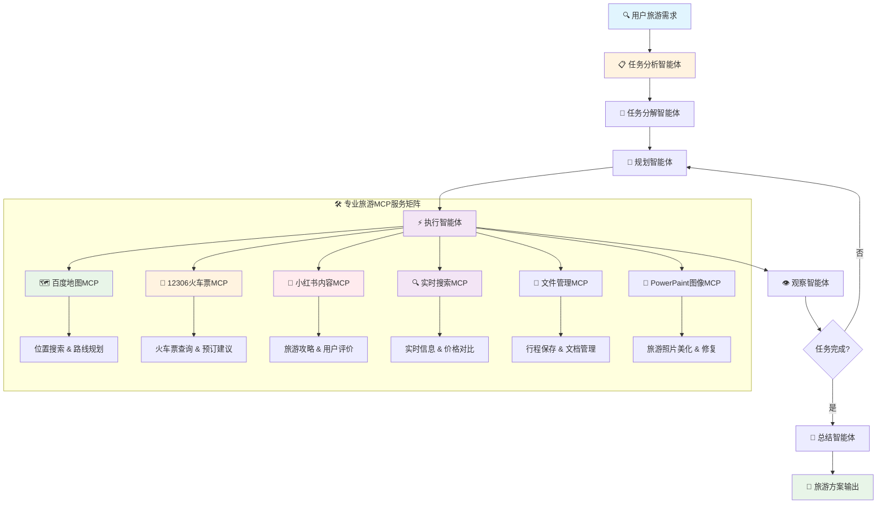

# 🚀 SuperTravelAgent 旅游规划智能体

[](LICENSE)[](https://python.org)[](https://github.com/ZHangZHengEric/SuperTravelAgent)


SuperTravelAgent 是一个多智能体旅游规划智能体，通过无缝衔接的智能体协作，智能地将复杂的旅游需求分解为可管理的规划任务。集成了业界最完整的旅游MCP服务器生态系统和先进的AI图像处理能力。

**🌟 核心优势**：
- **MCP服务矩阵**：集成百度地图、12306火车票、小红书社交内容、实时网络搜索等专业旅游MCP服务器
- **AI图像处理**：基于[PowerPaint](https://github.com/open-mmlab/PowerPaint)的多功能图像修复MCP，支持旅游照片美化、物体移除、图像扩展等功能
- **智能体协作**：六大专业智能体协同工作，为旅游规划提供前所未有的数据支撑和服务能力

## ✨ 核心亮点

🧠 **智能旅程规划** - 自动将复杂旅游需求分解为可管理的任务，支持行程依赖关系跟踪  
🔄 **六大智能体协作** - 专业旅游智能体间的无缝协调，具备强大的错误处理机制  
🛠️ **强大MCP服务矩阵** - 业界最完整的旅游MCP服务器生态系统  
🎨 **AI图像处理** - 集成PowerPaint多功能图像修复，支持旅游照片美化处理
🌐 **现代化Web界面** - React + TypeScript前端，FastAPI后端，实时WebSocket通信   
⚙️ **丰富配置系统** - 环境变量、配置文件、多模型支持和热重载  


## 🏗️ 架构概览

SuperTravelAgent 采用现代化多智能体协作架构，结合了强大的后端服务和业界最完整的旅游工具生态系统：


```mermaid
graph TB
    subgraph "🌐 前端应用"
        A[React + TypeScript 界面] --> B[Ant Design UI组件]
        B --> C[WebSocket实时通信]
        C --> D[智能体状态可视化]
    end
    
    subgraph "⚡ FastAPI后端"
        E[REST API接口] --> F[WebSocket管理器]
        F --> G[配置管理系统]
        G --> H[会话管理]
    end
    
    subgraph "🤖 多智能体系统"
        I[智能体控制器] --> J[任务分析智能体]
        I --> K[任务分解智能体]
        I --> L[规划智能体]
        I --> M[执行智能体]
        I --> N[观察智能体]
        I --> O[总结智能体]
    end
    
    subgraph "🛠️ 专业旅游MCP服务矩阵"
        P[MCP管理器] --> Q[🗺️ 百度地图MCP]
        P --> R[🚄 12306火车票MCP]
        P --> S[📱 小红书MCP]
        P --> T[🔍 网络搜索MCP]
        P --> U[📁 文件系统MCP]
        P --> V[🌐 HTTP请求MCP]
        P --> W1[🎨 PowerPaint图像MCP]
        
        Q --> Q1[地理编码/逆编码]
        Q --> Q2[POI搜索]
        Q --> Q3[路线规划]
        Q --> Q4[周边搜索]
        
        R --> R1[列车时刻表]
        R --> R2[余票查询]
        R --> R3[中转搜索]
        R --> R4[过站信息]
        
        S --> S1[旅游笔记搜索]
        S --> S2[用户体验分析]
        S --> S3[热门景点发现]
        S --> S4[社交内容筛选]
        
        T --> T1[实时信息搜索]
        T --> T2[旅游资讯获取]
        T --> T3[价格信息查询]
        
        W1 --> W11[图像修复/美化]
        W1 --> W12[物体移除/添加]
        W1 --> W13[图像扩展]
        W1 --> W14[形状引导生成]
    end
    
    subgraph "📊 监控统计"
        W[Token使用跟踪] --> X[成本分析]
        X --> Y[性能监控]
        Y --> Z[会话统计]
    end
    
    A --> E
    E --> I
        I --> P
    I --> W
    P --> M
    
    style A fill:#e1f5fe
    style I fill:#fff3e0
    style P fill:#f3e5f5
    style W fill:#e8f5e8
    style Q fill:#e8f5e8
    style R fill:#fff3e0
    style S fill:#ffebee
    style T fill:#f3e5f5
```

### 🔄 智能体工作流程


```mermaid
graph TD
    A[🔍 用户旅游需求] --> B[📋 任务分析智能体]
    B --> C[🎯 任务分解智能体]
    C --> D[📝 规划智能体]
    D --> E[⚡ 执行智能体]
    E --> F[👁️ 观察智能体]
    F --> G{任务完成?}
    G -->|否| D
    G -->|是| H[📄 总结智能体]
    H --> I[🎉 旅游方案输出]
    
    subgraph "🛠️ 专业旅游MCP服务矩阵"
        E --> J[🗺️ 百度地图MCP]
        E --> K[🚄 12306火车票MCP]
        E --> L[📱 小红书内容MCP]
        E --> M[🔍 实时搜索MCP]
        E --> N[📁 文件管理MCP]
        E --> O[🎨 PowerPaint图像MCP]
        
        J --> J1[位置搜索 & 路线规划]
        K --> K1[火车票查询 & 预订建议]
        L --> L1[旅游攻略 & 用户评价]
        M --> M1[实时信息 & 价格对比]
        N --> N1[行程保存 & 文档管理]
        O --> O1[旅游照片美化 & 修复]
    end
    
    style A fill:#e1f5fe
    style I fill:#e8f5e8
    style B fill:#fff3e0
    style E fill:#f3e5f5
    style J fill:#e8f5e8
    style K fill:#fff3e0
    style L fill:#ffebee
    style M fill:#f3e5f5
```

## 🚀 快速开始

### 📦 安装

```bash
# 克隆项目
git clone https://github.com/
cd SuperTravelAgent

# 安装Python依赖
pip install -r requirements.txt

# 安装前端依赖
cd frontend
npm install

# 启动前端
npm run dev

# 启动后端
cd backend
python main.py
```

然后在浏览器中访问 `http://localhost:8080` 体验SuperTravelAgent旅游规划智能体。

#### ⚙️ 配置API密钥


**DeepSeek (推荐)**
```
API密钥: your-deepseek-api-key
模型: deepseek-chat
API地址: https://api.deepseek.com/v1
```

**OpenRouter (多模型访问)**
```
API密钥: your-openrouter-api-key
模型: deepseek/deepseek-chat
API地址: https://openrouter.ai/api/v1
```

**OpenAI**
```
API密钥: your-openai-api-key
模型: gpt-4o
API地址: https://api.openai.com/v1
```

## 🎯 核心功能

### 🤖 **六大智能体协作系统**

#### 1. 任务分析智能体 (TaskAnalysisAgent)
- **深度需求理解**: 分析用户旅游需求的细节和偏好
- **上下文提取**: 识别预算、时间、目的地、兴趣点等关键信息
- **统一系统提示管理**: 为后续智能体提供一致的上下文理解

#### 2. 任务分解智能体 (TaskDecomposeAgent)
- **智能任务分解**: 将复杂旅游规划分解为可管理的子任务
- **依赖关系分析**: 识别任务间的逻辑依赖和执行顺序
- **并行规划支持**: 支持同时进行多个独立任务的规划

#### 3. 规划智能体 (PlanningAgent)
- **战略性行程设计**: 基于分解任务制定详细的执行计划
- **资源优化**: 最优工具选择和资源分配
- **风险评估**: 识别潜在问题并制定备选方案

#### 4. 执行智能体 (ExecutorAgent)
- **智能工具调用**: 自动选择和使用合适的工具完成任务
- **错误恢复机制**: 自动处理工具执行失败和异常情况
- **并行处理**: 支持同时执行多个独立的工具调用

#### 5. 观察智能体 (ObservationAgent)
- **进度监控**: 实时跟踪任务执行进度和状态
- **质量评估**: 评估执行结果的完整性和质量
- **完成度检测**: 智能判断任务是否达到预期目标

#### 6. 总结智能体 (TaskSummaryAgent)
- **结果综合**: 将所有执行结果整合为完整的旅游方案
- **结构化输出**: 生成清晰、可操作的旅游建议
- **价值提炼**: 提取关键信息和实用建议

### 🛠️ **强大的旅游工具生态系统**

SuperTravelAgent 集成了强大的专业旅游工具生态系统，通过Model Context Protocol (MCP) 提供无缝的服务集成：

#### 🗺️ **百度地图MCP**
```
🌟 核心能力: 中国最权威的地图和位置服务
```
- **地理编码服务**: 地址转坐标、坐标转地址，支持模糊匹配
- **POI搜索**: 周边景点、餐厅、酒店、交通站点智能搜索
- **路线规划**: 多种出行方式（步行、驾车、公交）最优路线计算
- **周边探索**: 基于位置的周边服务发现和推荐
- **距离计算**: 精确的距离和时间估算


#### 🚄 **12306火车票MCP**
```
🌟 核心能力: 中国铁路官方数据，最准确的火车票信息
```
- **列车时刻表查询**: 实时列车班次、时间、价格信息
- **余票实时查询**: 各车次座位余票情况动态监控
- **中转搜索**: 智能中转方案推荐和优化
- **过站信息**: 列车途经站点详细信息
- **车次筛选**: 根据时间、价格、车型智能筛选


#### 📱 **小红书社交内容MCP**
```
🌟 核心能力: 最丰富的用户原创旅游内容和真实体验分享
```
- **旅游笔记搜索**: 基于目的地的用户旅游经验和攻略
- **热门景点发现**: 社交平台热门打卡地和网红景点
- **用户评价分析**: 真实用户体验和评价数据挖掘
- **旅游趋势洞察**: 最新旅游趋势和热门目的地发现
- **内容筛选**: 高质量旅游内容智能筛选和推荐


#### 🔍 **Serper网络搜索MCP**
```
🌟 核心能力: 实时网络信息搜索和数据聚合
```
- **实时信息搜索**: 最新的旅游资讯、政策、天气等信息
- **价格信息聚合**: 机票、酒店、门票价格对比
- **新闻资讯获取**: 目的地最新动态和重要信息
- **多源信息整合**: 整合多个信息源的综合搜索结果

#### 📁 **文件系统管理MCP**
```
🌟 核心能力: 旅游规划结果的持久化存储和管理
```
- **行程文档保存**: 自动保存生成的旅游规划文档
- **多格式支持**: 支持JSON、Markdown等多种格式
- **版本管理**: 旅游计划的版本控制和历史记录
- **文件共享**: 生成可分享的旅游计划链接

#### 🌐 **HTTP请求服务 (Fetch MCP)**
```
🌟 核心能力: 灵活的HTTP请求能力，支持各种API调用
```
- **API集成**: 与第三方旅游服务API无缝集成
- **数据获取**: 从各种在线服务获取实时数据
- **内容抓取**: 智能网页内容提取和分析

#### 🎨 **PowerPaint图像处理**
```
🌟 核心能力: 基于ECCV 2024论文的多功能图像修复模型，专为旅游照片处理优化
```
- **智能图像修复**: 自动修复旅游照片中的瑕疵和不完美区域
- **物体移除**: 智能移除照片中不需要的人物、标志或干扰元素
- **物体添加**: 基于文本描述在指定位置添加新的物体或元素
- **图像扩展**: 智能扩展照片边界，创造更大视野的旅游照片
- **形状引导生成**: 根据指定形状和描述生成新的图像内容
- **旅游场景优化**: 专门针对风景照、人像照、建筑照的智能美化

**PowerPaint技术特点**：
- **一模型多任务**: 单一模型支持文本引导修复、物体移除、图像扩展、形状控制等多种功能
- **高质量输出**: 基于Stable Diffusion架构，确保生成图像的自然度和一致性
- **任务提示学习**: 创新的任务提示机制，无需重新训练即可适应不同图像处理需求
- **实时处理**: 优化的推理流程，支持旅游照片的快速批量处理

**旅游应用场景**：
- 移除旅游照片中的游客或杂物，获得完美的风景照
- 扩展照片边界，展现更完整的景观视野
- 智能修复因天气或拍摄条件导致的照片瑕疵
- 为旅游攻略创建更吸引人的示意图和说明图片

> 📚 **学术支持**: 基于论文 "A Task is Worth One Word: Learning with Task Prompts for High-Quality Versatile Image Inpainting" (ECCV 2024)  
> 🔗 **项目地址**: [PowerPaint GitHub](https://github.com/open-mmlab/PowerPaint)

### 🎨 **工具协作示例**

以下是各个专业工具如何协作完成复杂旅游规划任务的示例：

```python
# 用户询问: "帮我规划一次北京到上海的3天商务旅行，并美化我的旅游照片"
# 
# 六大智能体 + MCP服务器协作流程:
# 1. 📋 任务分析智能体 - 理解需求: 商务旅行、3天、北京到上海、照片处理
# 2. 🎯 任务分解智能体 - 分解任务: 交通、住宿、行程、预算、图像处理
# 3. 📝 规划智能体 - 制定计划: 调用多个MCP服务器
#    - 🗺️  百度地图MCP: 查询北京/上海重要商务区位置
#    - 🚄 12306火车票MCP: 查询北京到上海的高铁班次
#    - 📱 小红书MCP: 搜索上海商务酒店推荐和旅游攻略
#    - 🔍 网络搜索MCP: 查询上海天气和商务活动信息
#    - 🎨 PowerPaint: 准备照片美化和处理服务
# 4. ⚡ 执行智能体 - 并行执行: 同时调用各个MCP服务器
# 5. 👁️  观察智能体 - 监控质量: 确保信息完整性和准确性
# 6. 📄 总结智能体 - 生成方案: 整合所有信息生成完整旅行计划和照片处理指南
```


## 📁 项目结构

```
SuperTravelAgent/
├── 📁 agents/                  # 智能体核心模块
│   ├── 📁 agent/              # 智能体实现
│   │   ├── agent_controller.py    # 智能体控制器
│   │   ├── agent_base.py          # 智能体基类
│   │   ├── task_analysis_agent/   # 任务分析智能体
│   │   ├── task_decompose_agent/  # 任务分解智能体
│   │   ├── planning_agent/        # 规划智能体
│   │   ├── executor_agent/        # 执行智能体
│   │   ├── observation_agent/     # 观察智能体
│   │   └── task_summary_agent/    # 总结智能体
│   ├── 📁 tool/               # 工具系统
│   │   ├── tool_manager.py        # 工具管理器
│   │   └── tool_base.py          # 工具基类
│   ├── 📁 config/             # 配置管理
│   └── 📁 utils/              # 工具函数
├── 📁 backend/                # FastAPI后端
│   ├── main.py                # 主服务器文件
│   ├── config.yaml           # 后端配置
│   └── config_loader.py      # 配置加载器
├── 📁 frontend/               # React前端
│   ├── 📁 src/
│   │   ├── App.tsx           # 主应用组件
│   │   ├── 📁 components/    # UI组件
│   │   ├── 📁 hooks/         # React Hooks
│   │   └── 📁 utils/         # 前端工具
│   ├── package.json          # 前端依赖
│   └── vite.config.ts        # Vite配置
├── 📁 mcp_servers/            # MCP服务器生态系统
│   ├── mcp_setting.json      # MCP服务器配置文件
│   ├── 📁 xhs-mcp/           # 小红书内容MCP服务器
│   ├── 📁 serper-web-search-mcp/  # 网络搜索MCP服务器
├── 📁 outputs/                # 输出结果目录
└── requirements.txt           # Python依赖
```


### REST API
启动后端后，访问 `http://localhost:8000/docs` 查看完整的API文档。


## 🙏 致谢

感谢以下项目和服务为SuperTravelAgent提供的支持：

### 🛠️ **MCP服务器生态系统**
- **百度地图MCP** - 提供权威的中国地理位置和导航服务
- **12306火车票MCP** - 提供官方中国铁路数据支持
- **小红书MCP** - 提供丰富的旅游社交内容和用户体验
- **Serper搜索MCP** - 提供实时网络搜索和信息聚合服务
- **文件系统MCP** - 提供可靠的文档存储和管理功能

### 🎨 **AI图像处理**
- **[PowerPaint](https://github.com/open-mmlab/PowerPaint)** - 基于ECCV 2024论文的多功能图像修复模型
  - 论文: "A Task is Worth One Word: Learning with Task Prompts for High-Quality Versatile Image Inpainting"
  - 作者: Junhao Zhuang, Yanhong Zeng, Wenran Liu, Chun Yuan, Kai Chen
  - 为SuperTravelAgent提供强大的旅游照片处理和美化能力

### 🤖 **AI模型与框架**
- **OpenAI & DeepSeek** - 提供强大的大语言模型支持
- **Model Context Protocol (MCP)** - 提供标准化的AI工具集成协议
- **Sage Framework** - 提供多智能体协作框架支持 [GitHub](https://github.com/ZHangZHengEric/Sage)

### 💻 **技术框架**
- **FastAPI** - 提供高性能的异步Web框架
- **React + TypeScript** - 提供现代化的前端开发框架
- **Ant Design** - 提供专业的UI组件库
- **WebSocket** - 提供实时通信能力
---

**SuperTravelAgent** - 强大的智能旅游规划专家 ✈️🌍
