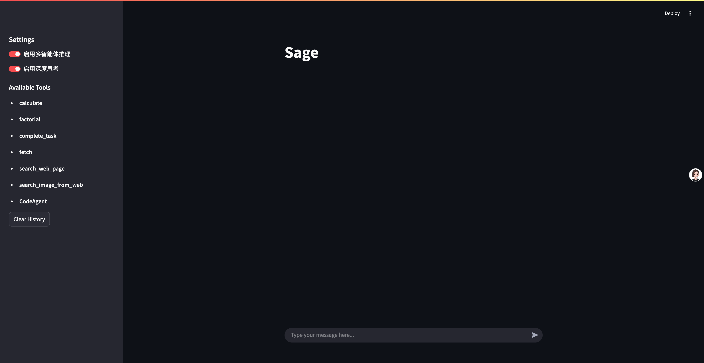
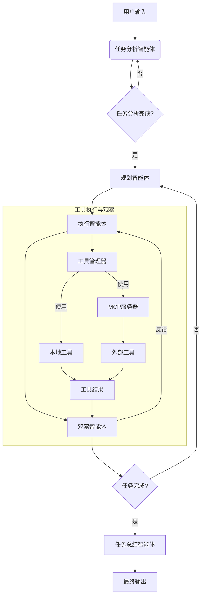

[](README.md)
[](README_CN.md)

# 多智能体系统框架

一个模块化的多智能体系统框架，提供两种不同的工作模式：
1. **深度研究模式**：全面的多智能体协作，适用于复杂问题解决
2. **快速执行模式**：轻量级智能体优化，实现快速任务完成

提供两种模式下的任务分解和执行能力。

## 特性

- **智能体流水线**: 任务分析 → 规划 → 执行 → 观察 → 总结
- **工具系统**: 可扩展的工具集成与自动注册
- **MCP服务器支持**: 通过MCP协议管理外部工具
- **消息流**: 智能体间的结构化消息传递
- **模块化设计**: 易于扩展新智能体和工具

## 安装

```bash
git clone https://github.com/your-repo/multi-agent.git
cd multi-agent
pip install -r requirements.txt
```

## MCP服务器设置

使用MCP服务器连接外部工具:

1. 安装所需依赖:
```bash
pip install uvicorn
```

2. 启动MCP服务器:
```bash
bash mcp_servers/run_all_mcp_server.sh
```

3. 在`mcp_servers/mcp_setting.json`中配置服务器:
- 将需要使用的服务器设为`disabled: false`
- 根据需要配置API密钥和端点

系统会自动发现并注册运行中的MCP服务器提供的工具。

## 示例

运行网页演示:
```bash
streamlit run sage_demo.py -- --api-key your_api_key --model deepseek-chat --base-url https://api.deepseek.com/v1
```

## 架构



## 核心组件

### 智能体

- **智能体控制器**: 用户请求的主入口
- **智能体基类**: 所有智能体的基类
- **任务分析智能体**: 分析和理解用户需求
- **规划智能体**: 规划子任务和依赖关系
- **执行智能体**: 使用工具执行子任务
- **观察智能体**: 监控任务进度
- **任务总结智能体**: 生成最终输出总结

### 工具系统

- **工具基类**: 所有工具的接口
- **工具管理器**: 管理工具注册和发现
- **MCP服务器集成**: 通过MCP协议注册和管理外部工具
- **网页搜索工具**: 示例网页搜索工具
- **计算工具**: 示例计算工具

#### MCP服务器支持
工具管理器可以注册和管理MCP服务器提供的工具:
- 支持stdio和SSE两种连接模式
- 自动工具发现和注册
- 与执行智能体无缝集成

## 消息格式

消息遵循结构化格式，包含类型:
- `normal`: 常规对话消息
- `thinking`: 中间思考过程

示例流程:
```json
{"role":"user","content":"用户请求","type":"normal","message_id":""}
{"role":"assistant","content":"Thinking: babab","type":"task_analysis_result"} 文字流式
{"role":"assistant","content":"Planning: {}","type":"planning_result"} 整体发送
{"role":"assistant","content":"Observation: {}","type":"observation_result"} 整体发送
{"role":"assistant","tool_calls":[],"type":"tool_call"}  整体发送
{"role":"assistant","content":"","type":"do_subtask_result"} 整体发送
{"role":"tool","content":"json","type":"tool_call_result","tool_call_id":""} 整体发送
{"role":"assistant","content":"","type":"final_answer"}
```

## 目录结构

```
agents/
    agent/
        agent_controller.py
        agent_base.py
        task_analysis_agent/
        planning_agent/ 
        executor_agent/
        observation_agent/
        task_summary_agent/
    tool/
        tool_base.py
        tool_manager.py
        web_search_tool.py
        calculation_tool.py
examples/
    sage_demo.py
```

## 贡献指南

1. Fork本仓库
2. 创建新分支
3. 提交Pull Request


## 许可证

MIT
