{: .note }
> Looking for the Chinese version? Check out [架构指南](ARCHITECTURE_CN.html)

## Table of Contents
{: .no_toc .text-delta }

1. TOC
{:toc}

# 🏗️ Architecture Guide (v0.9)

This document provides a comprehensive overview of Sage Multi-Agent Framework's enhanced architecture, design principles, and internal workflows with production-ready features.

## 📋 Table of Contents

- [Core Design Principles](#-core-design-principles)
- [System Overview](#-system-overview)
- [Component Architecture](#-component-architecture)
- [Agent Workflow](#-agent-workflow)
- [Token Tracking System](#-token-tracking-system)
- [Message Flow](#-message-flow)
- [Tool System](#-tool-system)
- [Error Handling & Recovery](#-error-handling--recovery)
- [Configuration System](#-configuration-system)
- [Performance Monitoring](#-performance-monitoring)
- [Extension Points](#-extension-points)

## 🎯 Core Design Principles

### 1. **Production Readiness**
- Enterprise-grade error handling and recovery
- Comprehensive monitoring and observability
- Performance optimization and resource management
- Cost tracking and usage analytics

### 2. **Modularity & Maintainability**
- Each agent has a single, well-defined responsibility
- Clear interfaces and dependency injection
- Hot-reloadable components and plugins
- Comprehensive unit and integration testing

### 3. **Extensibility & Flexibility**
- Plugin-based architecture for tools and agents
- Configurable execution pipelines
- Support for multiple LLM providers and API formats
- Runtime configuration updates

### 4. **Observability & Monitoring**
- Real-time token usage tracking and cost monitoring
- Comprehensive logging with structured outputs
- Performance metrics and bottleneck detection
- Streaming visualization and progress tracking

### 5. **Reliability & Resilience**
- Graceful error handling with automatic recovery
- Retry mechanisms with exponential backoff
- Circuit breaker patterns for external services
- Memory management and resource cleanup

## 🌐 System Overview

```mermaid
graph TB
    subgraph "🎮 User Interface Layer"
        UI[Web Interface<br/>📊 Real-time Monitoring]
        CLI[Command Line<br/>⚡ High Performance]
        API[Python API<br/>🔧 Full Control]
    end
    
    subgraph "🧠 Control Layer"
        AC[AgentController<br/>📈 Enhanced Orchestration]
        TT[TokenTracker<br/>💰 Cost Monitoring]
        PM[PerformanceMonitor<br/>⏱️ Metrics]
        EM[ErrorManager<br/>🛡️ Recovery]
    end
    
    subgraph "🤖 Agent Layer (v0.9)"
        TA[TaskAnalysisAgent<br/>🎯 Context Aware]
        TDA[TaskDecomposeAgent<br/>🎯 Intelligent Breakdown]
        PA[PlanningAgent<br/>🧩 Dependency Management]
        EA[ExecutorAgent<br/>🔧 Tool Integration]
        OA[ObservationAgent<br/>👁️ Progress Tracking]
        SA[SummaryAgent<br/>📄 Structured Output]
        DA[DirectExecutorAgent<br/>⚡ Rapid Mode]
    end
    
    subgraph "🛠️ Enhanced Tool Layer"
        TM[ToolManager<br/>🔍 Auto-Discovery]
        BT[Built-in Tools<br/>📱 Core Functions]
        MCP[MCP Servers<br/>🌐 External APIs]
        CT[Custom Tools<br/>🎨 User Defined]
        TO[ToolOrchestrator<br/>⚙️ Load Balancing]
    end
    
    subgraph "⚙️ Infrastructure Layer"
        CFG[Configuration<br/>📋 Hot Reload]
        LOG[Logging<br/>📝 Structured]
        EXC[Exception Handling<br/>🔄 Auto Recovery]
        LLM[LLM Providers<br/>🤖 Multi-API]
        CACHE[Caching Layer<br/>💾 Performance]
    end
    
    UI --> AC
    CLI --> AC
    API --> AC
    
    AC <--> TT
    AC <--> PM
    AC <--> EM
    
    AC --> TA
    AC --> TDA
    AC --> PA
    AC --> EA
    AC --> OA
    AC --> SA
    AC --> DA
    
    EA --> TM
    TM --> TO
    TO --> BT
    TO --> MCP
    TO --> CT
    
    AC --> CFG
    AC --> LOG
    AC --> EXC
    AC --> LLM
    AC --> CACHE
    
    TT -.-> TA
    TT -.-> TDA
    TT -.-> PA
    TT -.-> EA
    TT -.-> OA
    TT -.-> SA
    
    style AC fill:#ff9999
    style TT fill:#ffcc99
    style TM fill:#99ccff
    style EM fill:#ff99cc
```



## 🔧 Component Architecture

### AgentController (Enhanced v0.9)
The central orchestrator with enterprise-grade features.

```python
class AgentController:
    """
    Enhanced multi-agent workflow orchestrator
    
    New v0.9 Features:
    - Comprehensive token tracking and cost monitoring
    - Performance metrics and bottleneck detection
    - Advanced error recovery with retry mechanisms
    - Real-time streaming with progress visualization
    - Memory optimization for long-running tasks
    - Task Decompose Agent integration
    - Unified system context management
    """
    
    def run(self, messages, tool_manager, **kwargs):
        """Execute complete workflow with monitoring"""
        
    def run_stream(self, messages, tool_manager, **kwargs):
        """Execute with real-time streaming and progress tracking"""
        
    def get_comprehensive_token_stats(self):
        """Get detailed token usage and cost analysis"""
        
    def enable_performance_monitoring(self):
        """Enable detailed performance tracking"""
```

**Enhanced Features:**
- **Token Economics**: Real-time cost tracking and budget alerts
- **Performance Analytics**: Execution time analysis and optimization suggestions
- **Memory Management**: Automatic cleanup and resource optimization
- **Circuit Breakers**: Automatic failure detection and recovery
- **Load Balancing**: Intelligent tool selection and request distribution
- **Task Decomposition**: New specialized agent for intelligent task breakdown

### Agent Hierarchy (Enhanced v0.9)


## 📊 Token Tracking System

### Architecture Overview


### Token Usage Flow

```python
# Enhanced token tracking with detailed metrics
class TokenTracker:
    def track_agent_usage(self, agent_name, usage_data):
        """Track token usage per agent with cost calculation"""
        
    def track_streaming_usage(self, chunks, agent_name):
        """Track streaming responses with real-time updates"""
        
    def calculate_costs(self, model_name, usage_data):
        """Calculate costs based on model pricing"""
        
    def get_performance_insights(self):
        """Analyze performance patterns and bottlenecks"""
        
    def export_detailed_report(self, format='csv'):
        """Export comprehensive usage report"""
```

**Key Metrics Tracked:**
- **Input Tokens**: Request processing costs
- **Output Tokens**: Response generation costs  
- **Cached Tokens**: Optimization savings
- **Reasoning Tokens**: Advanced model features (o1, etc.)
- **Execution Time**: Performance tracking
- **Success Rates**: Reliability metrics
- **Cost per Operation**: Economic efficiency

### Tool System Architecture (Enhanced)

```mermaid
graph TB
    subgraph "🔧 Discovery & Registration"
        AD[Auto Discovery<br/>📂 Directory Scanning]
        TR[Tool Registry<br/>📋 Central Catalog]
        TV[Tool Validation<br/>✅ Schema Checking]
        TH[Tool Health Check<br/>🩺 Status Monitoring]
    end
    
    subgraph "🛠️ Tool Categories"
        LT[Local Tools<br/>📱 Built-in Functions]
        MT[MCP Tools<br/>🌐 External Servers]
        AT[Agent Tools<br/>🤖 Agent Wrappers]
        CT[Custom Tools<br/>🎨 User Extensions]
    end
    
    subgraph "⚡ Execution Engine"
        TE[Tool Executor<br/>🔧 Multi-threaded]
        TQ[Task Queue<br/>📬 Load Balancing]
        CB[Circuit Breaker<br/>🛡️ Fault Tolerance]
        RM[Retry Manager<br/>🔄 Error Recovery]
    end
    
    subgraph "📊 Monitoring"
        PM[Performance Monitor<br/>⏱️ Metrics]
        LB[Load Balancer<br/>⚖️ Distribution]
        CH[Cache Handler<br/>💾 Optimization]
    end
    
    AD --> TR
    TV --> TR
    TH --> TR
    
    TR --> LT
    TR --> MT
    TR --> AT
    TR --> CT
    
    LT --> TQ
    MT --> TQ
    AT --> TQ
    CT --> TQ
    
    TQ --> TE
    TE --> CB
    TE --> RM
    
    TE --> PM
    PM --> LB
    LB --> CH
```



## 🛡️ Error Handling & Recovery

### Multi-layered Error Management

```mermaid
graph TD
    subgraph "🎯 Detection Layer"
        ED[Error Detection<br/>🔍 Real-time Monitoring]
        TD[Timeout Detection<br/>⏰ Resource Management]
        FD[Failure Detection<br/>💥 Anomaly Identification]
    end
    
    subgraph "🔄 Recovery Layer"
        AR[Auto Retry<br/>🔁 Exponential Backoff]
        FB[Fallback Strategy<br/>🛤️ Alternative Paths]
        GD[Graceful Degradation<br/>📉 Reduced Functionality]
    end
    
    subgraph "📝 Logging Layer"
        SL[Structured Logging<br/>📊 JSON Format]
        AT[Alert Triggering<br/>🚨 Notifications]
        RM[Recovery Metrics<br/>📈 Success Tracking]
    end
    
    ED --> AR
    TD --> FB
    FD --> GD
    
    AR --> SL
    FB --> AT
    GD --> RM
```



### Error Categories and Strategies

```python
class ErrorManager:
    """Comprehensive error handling and recovery system"""
    
    ERROR_STRATEGIES = {
        'NetworkError': 'retry_with_backoff',
        'TokenLimitError': 'truncate_and_retry',
        'ToolTimeoutError': 'fallback_to_alternative',
        'ModelUnavailableError': 'switch_provider',
        'ValidationError': 'graceful_degradation'
    }
    
    def handle_error(self, error, context):
        """Route errors to appropriate recovery strategies"""
        
    def retry_with_backoff(self, operation, max_attempts=3):
        """Implement exponential backoff retry logic"""
        
    def circuit_breaker(self, service_name, failure_threshold=5):
        """Implement circuit breaker pattern for external services"""
```

## 📈 Performance Monitoring

### Real-time Metrics Collection

```mermaid
graph LR
    subgraph "📊 Data Collection"
        ET[Execution Timing]
        MU[Memory Usage]
        TU[Token Consumption]
        TR[Tool Response Times]
    end
    
    subgraph "🔍 Analysis Engine"
        BA[Bottleneck Analysis]
        PA[Performance Profiling]
        CA[Cost Analysis]
        RA[Resource Analysis]
    end
    
    subgraph "🎯 Optimization"
        RS[Resource Scaling]
        LO[Load Optimization]
        CC[Cache Control]
        PT[Performance Tuning]
    end
    
    ET --> BA
    MU --> PA
    TU --> CA
    TR --> RA
    
    BA --> RS
    PA --> LO
    CA --> CC
    RA --> PT
```



### Performance Analytics

```python
class PerformanceMonitor:
    """Advanced performance monitoring and optimization"""
    
    def collect_metrics(self):
        """Collect comprehensive performance data"""
        return {
            'execution_times': self._get_execution_times(),
            'memory_usage': self._get_memory_stats(),
            'token_efficiency': self._analyze_token_usage(),
            'tool_performance': self._get_tool_metrics(),
            'bottlenecks': self._identify_bottlenecks()
        }
    
    def generate_optimization_report(self):
        """Generate actionable optimization recommendations"""
        
    def export_performance_data(self, format='json'):
        """Export detailed performance analytics"""
```

## ⚙️ Enhanced Configuration System

### Hierarchical Configuration Management

```mermaid
graph TD
    subgraph "📁 Configuration Sources"
        ENV[Environment Variables<br/>🌍 System Level]
        FILE[Config Files<br/>📄 YAML/JSON]
        CLI[Command Line<br/>⌨️ Runtime Args]
        API[API Parameters<br/>🔧 Programmatic]
    end
    
    subgraph "🔄 Processing Layer"
        VAL[Validation Engine<br/>✅ Schema Checking]
        MER[Config Merger<br/>🔀 Priority Handling]
        HOT[Hot Reload<br/>🔥 Runtime Updates]
    end
    
    subgraph "💾 Storage & Distribution"
        CS[Config Store<br/>📚 Centralized]
        CD[Config Distribution<br/>📡 Component Updates]
        CB[Config Backup<br/>💼 Version Control]
    end
    
    ENV --> VAL
    FILE --> VAL
    CLI --> VAL
    API --> VAL
    
    VAL --> MER
    MER --> HOT
    HOT --> CS
    
    CS --> CD
    CS --> CB
```



### Configuration Schema

```python
class ConfigurationManager:
    """Enterprise-grade configuration management"""
    
    SCHEMA = {
        'agents': {
            'max_loop_count': {'type': 'int', 'default': 10, 'min': 1, 'max': 50},
            'tool_timeout': {'type': 'int', 'default': 30, 'min': 5, 'max': 300},
            'retry_attempts': {'type': 'int', 'default': 3, 'min': 1, 'max': 10}
        },
        'performance': {
            'enable_monitoring': {'type': 'bool', 'default': True},
            'memory_threshold': {'type': 'int', 'default': 1024, 'min': 256},
            'cache_ttl': {'type': 'int', 'default': 3600, 'min': 60}
        },
        'costs': {
            'budget_alert_threshold': {'type': 'float', 'default': 10.0, 'min': 0.1},
            'cost_tracking_enabled': {'type': 'bool', 'default': True}
        }
    }
    
    def validate_config(self, config):
        """Validate configuration against schema"""
        
    def hot_reload(self, config_path):
        """Reload configuration without restart"""
```

## 🔌 Extension Points

### Plugin Architecture

```python
class PluginManager:
    """Extensible plugin system for custom functionality"""
    
    def register_agent_plugin(self, plugin_class):
        """Register custom agent implementations"""
        
    def register_tool_plugin(self, plugin_class):
        """Register custom tool implementations"""
        
    def register_middleware(self, middleware_class):
        """Register request/response middleware"""
        
    def load_plugins_from_directory(self, directory):
        """Auto-discover and load plugins"""
```

### Custom Agent Development

```python
class CustomAgent(AgentBase):
    """Template for creating custom agents"""
    
    def __init__(self, model, config):
        super().__init__(model, config, system_prefix="Custom Agent Prompt")
        self.agent_description = "Custom agent for specific tasks"
    
    def run_stream(self, messages, tool_manager, context):
        """Implement custom agent logic"""
        # Your custom implementation here
        yield from self._execute_streaming_with_token_tracking(
            prompt="Your custom prompt",
            step_name="custom_operation"
        )
```

## 🎯 Message Flow & Data Structures

### Enhanced Message Format

```python
# Enhanced message structure with monitoring metadata
MESSAGE_SCHEMA = {
    'role': str,              # 'user', 'assistant', 'tool'
    'content': str,           # Main message content
    'type': str,              # 'normal', 'thinking', 'tool_call', etc.
    'message_id': str,        # Unique identifier
    'show_content': str,      # Display-friendly content
    'usage': {                # Token usage information
        'prompt_tokens': int,
        'completion_tokens': int,
        'total_tokens': int,
        'cached_tokens': int,
        'reasoning_tokens': int
    },
    'metadata': {             # Performance and monitoring data
        'execution_time': float,
        'agent_name': str,
        'step_name': str,
        'timestamp': float,
        'success': bool
    },
    'tool_calls': List,       # Tool invocation data
    'tool_call_id': str       # Tool response linking
}
```

This enhanced architecture provides enterprise-grade reliability, comprehensive monitoring, and production-ready performance optimization while maintaining the modularity and extensibility that makes Sage powerful for development. 