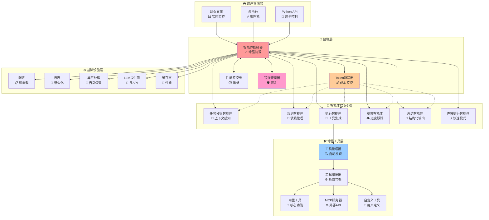
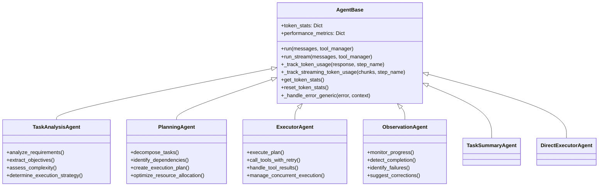
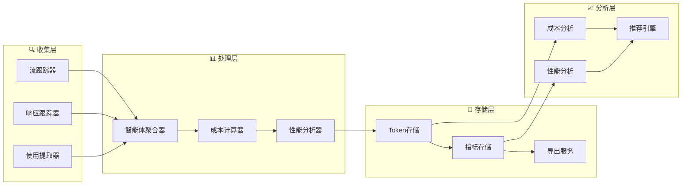
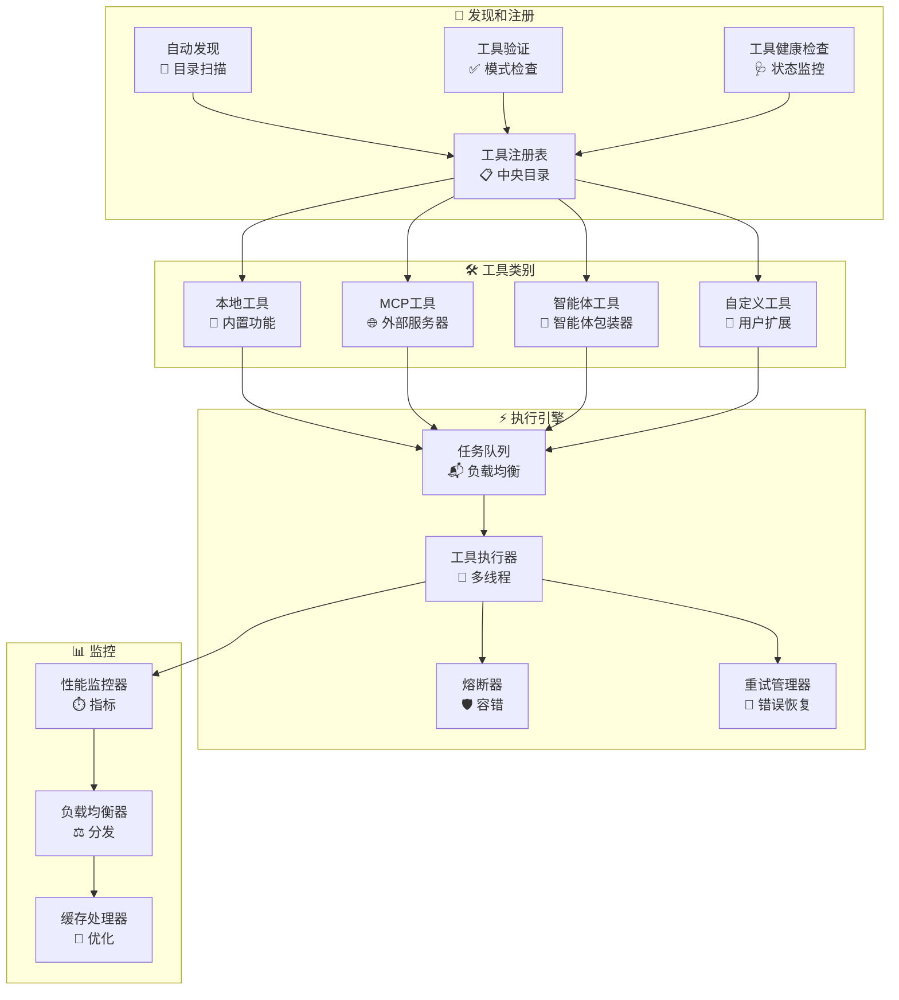
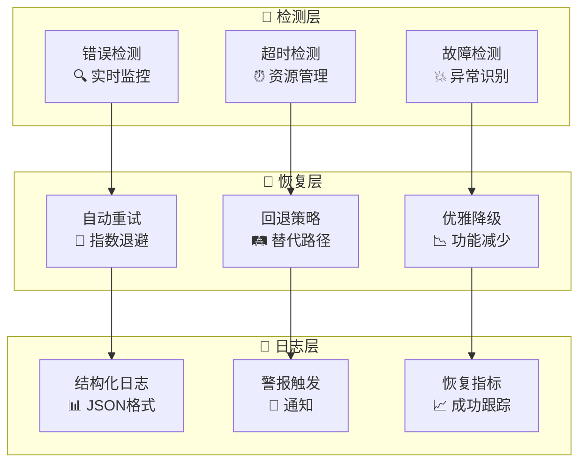
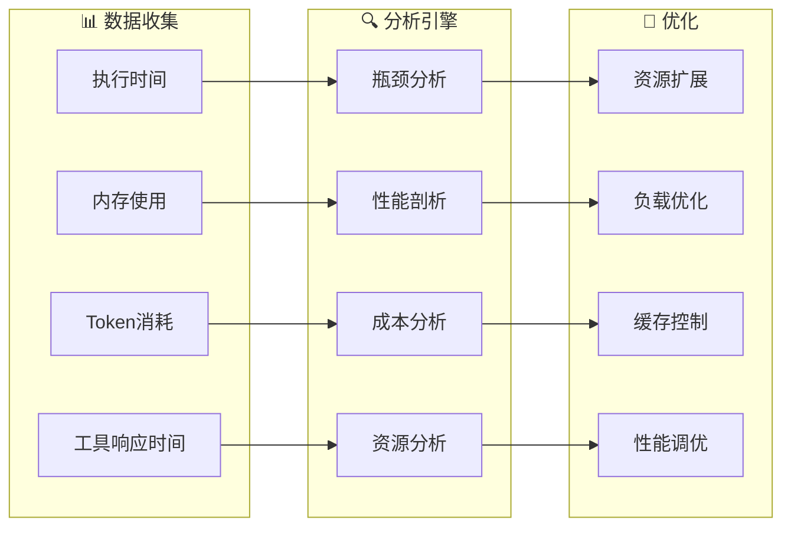
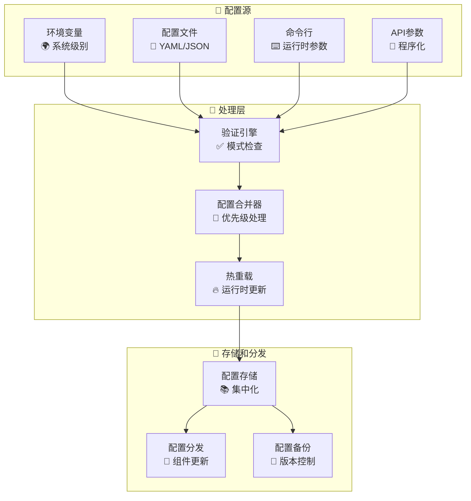

# 🏗️ 架构指南 (v2.0)

本文档提供了 Sage 多智能体框架增强架构、设计原则和生产就绪功能的内部工作流程的全面概述。

## 📋 目录

- [核心设计原则](#-核心设计原则)
- [系统概述](#-系统概述)
- [组件架构](#-组件架构)
- [智能体工作流程](#-智能体工作流程)
- [Token跟踪系统](#-token跟踪系统)
- [消息流程](#-消息流程)
- [工具系统](#-工具系统)
- [错误处理和恢复](#-错误处理和恢复)
- [配置系统](#-配置系统)
- [性能监控](#-性能监控)
- [扩展点](#-扩展点)

## 🎯 核心设计原则

### 1. **生产就绪**
- 企业级错误处理和恢复
- 全面监控和可观测性
- 性能优化和资源管理
- 成本跟踪和使用分析

### 2. **模块化和可维护性**
- 每个智能体都有单一、明确定义的职责
- 清晰的接口和依赖注入
- 组件和插件的热重载
- 全面的单元测试和集成测试

### 3. **可扩展性和灵活性**
- 基于插件的工具和智能体架构
- 可配置的执行流水线
- 支持多个LLM提供商和API格式
- 运行时配置更新

### 4. **可观测性和监控**
- 实时token使用跟踪和成本监控
- 结构化输出的全面日志
- 性能指标和瓶颈检测
- 流式可视化和进度跟踪

### 5. **可靠性和韧性**
- 自动恢复的优雅错误处理
- 指数退避重试机制
- 外部服务的熔断器模式
- 内存管理和资源清理

## 🌐 系统概述



## 🔧 组件架构

### 智能体控制器（增强版v2.0）
具有企业级功能的中央编排器。

```python
class AgentController:
    """
    增强的多智能体工作流程编排器
    
    v2.0新功能:
    - 全面的token跟踪和成本监控
    - 性能指标和瓶颈检测
    - 带重试机制的高级错误恢复
    - 进度可视化的实时流式处理
    - 长时间运行任务的内存优化
    """
    
    def run(self, messages, tool_manager, **kwargs):
        """执行带监控的完整工作流程"""
        
    def run_stream(self, messages, tool_manager, **kwargs):
        """执行带实时流式处理和进度跟踪"""
        
    def get_comprehensive_token_stats(self):
        """获取详细的token使用和成本分析"""
        
    def enable_performance_monitoring(self):
        """启用详细性能跟踪"""
```

**增强功能:**
- **Token经济学**: 实时成本跟踪和预算警报
- **性能分析**: 执行时间分析和优化建议
- **内存管理**: 自动清理和资源优化
- **熔断器**: 自动故障检测和恢复
- **负载均衡**: 智能工具选择和请求分发

### 智能体层次结构（重构版v2.0）



## 📊 Token跟踪系统

### 架构概述



### Token使用流程

```python
# 带详细指标的增强token跟踪
class TokenTracker:
    def track_agent_usage(self, agent_name, usage_data):
        """按智能体跟踪token使用并计算成本"""
        
    def track_streaming_usage(self, chunks, agent_name):
        """跟踪带实时更新的流式响应"""
        
    def calculate_costs(self, model_name, usage_data):
        """基于模型定价计算成本"""
        
    def get_performance_insights(self):
        """分析性能模式和瓶颈"""
        
    def export_detailed_report(self, format='csv'):
        """导出全面使用报告"""
```

**跟踪的关键指标:**
- **输入Token**: 请求处理成本
- **输出Token**: 响应生成成本  
- **缓存Token**: 优化节省
- **推理Token**: 高级模型功能（o1等）
- **执行时间**: 性能跟踪
- **成功率**: 可靠性指标
- **每次操作成本**: 经济效率

### 工具系统架构（增强版）



## 🛡️ 错误处理和恢复

### 多层错误管理



### 错误类别和策略

```python
class ErrorManager:
    """全面的错误处理和恢复系统"""
    
    ERROR_STRATEGIES = {
        'NetworkError': 'retry_with_backoff',
        'TokenLimitError': 'truncate_and_retry',
        'ToolTimeoutError': 'fallback_to_alternative',
        'ModelUnavailableError': 'switch_provider',
        'ValidationError': 'graceful_degradation'
    }
    
    def handle_error(self, error, context):
        """将错误路由到适当的恢复策略"""
        
    def retry_with_backoff(self, operation, max_attempts=3):
        """实现指数退避重试逻辑"""
        
    def circuit_breaker(self, service_name, failure_threshold=5):
        """为外部服务实现熔断器模式"""
```

## 📈 性能监控

### 实时指标收集



### 性能分析

```python
class PerformanceMonitor:
    """高级性能监控和优化"""
    
    def collect_metrics(self):
        """收集全面的性能数据"""
        return {
            'execution_times': self._get_execution_times(),
            'memory_usage': self._get_memory_stats(),
            'token_efficiency': self._analyze_token_usage(),
            'tool_performance': self._get_tool_metrics(),
            'bottlenecks': self._identify_bottlenecks()
        }
    
    def generate_optimization_report(self):
        """生成可操作的优化建议"""
        
    def export_performance_data(self, format='json'):
        """导出详细的性能分析"""
```

## ⚙️ 增强配置系统

### 分层配置管理



### 配置模式

```python
class ConfigurationManager:
    """企业级配置管理"""
    
    SCHEMA = {
        'agents': {
            'max_loop_count': {'type': 'int', 'default': 10, 'min': 1, 'max': 50},
            'tool_timeout': {'type': 'int', 'default': 30, 'min': 5, 'max': 300},
            'retry_attempts': {'type': 'int', 'default': 3, 'min': 1, 'max': 10}
        },
        'performance': {
            'enable_monitoring': {'type': 'bool', 'default': True},
            'memory_threshold': {'type': 'int', 'default': 1024, 'min': 256},
            'cache_ttl': {'type': 'int', 'default': 3600, 'min': 60}
        },
        'costs': {
            'budget_alert_threshold': {'type': 'float', 'default': 10.0, 'min': 0.1},
            'cost_tracking_enabled': {'type': 'bool', 'default': True}
        }
    }
    
    def validate_config(self, config):
        """根据模式验证配置"""
        
    def hot_reload(self, config_path):
        """不重启重新加载配置"""
```

## 🔌 扩展点

### 插件架构

```python
class PluginManager:
    """自定义功能的可扩展插件系统"""
    
    def register_agent_plugin(self, plugin_class):
        """注册自定义智能体实现"""
        
    def register_tool_plugin(self, plugin_class):
        """注册自定义工具实现"""
        
    def register_middleware(self, middleware_class):
        """注册请求/响应中间件"""
        
    def load_plugins_from_directory(self, directory):
        """自动发现和加载插件"""
```

### 自定义智能体开发

```python
class CustomAgent(AgentBase):
    """创建自定义智能体的模板"""
    
    def __init__(self, model, config):
        super().__init__(model, config, system_prefix="自定义智能体提示")
        self.agent_description = "用于特定任务的自定义智能体"
    
    def run_stream(self, messages, tool_manager, context):
        """实现自定义智能体逻辑"""
        # 您的自定义实现在这里
        yield from self._execute_streaming_with_token_tracking(
            prompt="您的自定义提示",
            step_name="custom_operation"
        )
```

## 🎯 消息流程和数据结构

### 增强消息格式

```python
# 带监控元数据的增强消息结构
MESSAGE_SCHEMA = {
    'role': str,              # 'user', 'assistant', 'tool'
    'content': str,           # 主要消息内容
    'type': str,              # 'normal', 'thinking', 'tool_call', 等
    'message_id': str,        # 唯一标识符
    'show_content': str,      # 显示友好内容
    'usage': {                # Token使用信息
        'prompt_tokens': int,
        'completion_tokens': int,
        'total_tokens': int,
        'cached_tokens': int,
        'reasoning_tokens': int
    },
    'metadata': {             # 性能和监控数据
        'execution_time': float,
        'agent_name': str,
        'step_name': str,
        'timestamp': float,
        'success': bool
    },
    'tool_calls': List,       # 工具调用数据
    'tool_call_id': str       # 工具响应链接
}
```

这种增强的架构提供了企业级可靠性、全面监控和生产就绪的性能优化，同时保持了使Sage在开发中强大的模块化和可扩展性。 