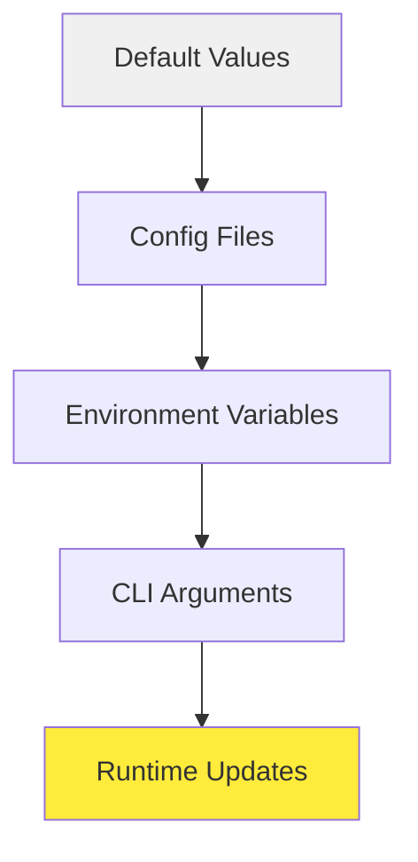

# ⚙️ Configuration Reference

This document provides a complete reference for configuring Sage Multi-Agent Framework.

## 📋 Table of Contents

- [Configuration Hierarchy](#-configuration-hierarchy)
- [Environment Variables](#-environment-variables)
- [Configuration Files](#-configuration-files)
- [CLI Arguments](#-cli-arguments)
- [Runtime Configuration](#-runtime-configuration)
- [Model Configuration](#-model-configuration)
- [Agent Configuration](#-agent-configuration)
- [Tool Configuration](#-tool-configuration)
- [Advanced Settings](#-advanced-settings)

## 🏗️ Configuration Hierarchy

Sage uses a layered configuration system where settings are applied in the following order (later values override earlier ones):



1. **Default Values**: Built-in defaults in the code
2. **Config Files**: YAML/JSON configuration files
3. **Environment Variables**: System environment variables
4. **CLI Arguments**: Command-line arguments
5. **Runtime Updates**: Dynamic updates during execution

## 🌍 Environment Variables

### Core Settings

| Variable | Type | Default | Description |
|----------|------|---------|-------------|
| `OPENAI_API_KEY` | string | None | OpenAI API key for model access |
| `SAGE_DEBUG` | boolean | false | Enable debug logging |
| `SAGE_ENVIRONMENT` | string | "production" | Runtime environment (development/production) |
| `SAGE_LOG_LEVEL` | string | "INFO" | Logging level (DEBUG/INFO/WARNING/ERROR) |
| `SAGE_CONFIG_PATH` | string | "./config" | Path to configuration files |

### Model Settings

| Variable | Type | Default | Description |
|----------|------|---------|-------------|
| `SAGE_MODEL_NAME` | string | "gpt-3.5-turbo" | Default model name |
| `SAGE_BASE_URL` | string | None | Custom API base URL |
| `SAGE_MAX_TOKENS` | integer | 4096 | Maximum tokens per request |
| `SAGE_TEMPERATURE` | float | 0.7 | Model temperature (0-1) |
| `SAGE_TIMEOUT` | integer | 60 | Request timeout in seconds |

### Agent Settings

| Variable | Type | Default | Description |
|----------|------|---------|-------------|
| `SAGE_MAX_ITERATIONS` | integer | 10 | Maximum agent iterations |
| `SAGE_DEEP_THINKING` | boolean | true | Enable task analysis by default |
| `SAGE_DEEP_RESEARCH` | boolean | true | Enable deep research mode in streaming by default |
| `SAGE_SUMMARY_MODE` | boolean | true | Generate summaries by default |
| `SAGE_STREAMING` | boolean | false | Enable streaming by default |

### Tool Settings

| Variable | Type | Default | Description |
|----------|------|---------|-------------|
| `SAGE_TOOLS_PATH` | string | "./agents/tool" | Path to tool directories |
| `SAGE_MCP_SERVERS_PATH` | string | "./mcp_servers" | Path to MCP server configs |
| `SAGE_TOOL_TIMEOUT` | integer | 30 | Tool execution timeout |
| `SAGE_MAX_CONCURRENT_TOOLS` | integer | 5 | Max parallel tool executions |

### Example .env File

```bash
# .env file for Sage configuration

# API Configuration
OPENAI_API_KEY=sk-your-openai-api-key-here
SAGE_BASE_URL=https://api.openai.com/v1

# Model Settings
SAGE_MODEL_NAME=gpt-4
SAGE_MAX_TOKENS=8192
SAGE_TEMPERATURE=0.3

# Agent Behavior
SAGE_DEEP_THINKING=true
SAGE_DEEP_RESEARCH=true
SAGE_SUMMARY_MODE=true
SAGE_MAX_ITERATIONS=15

# Development Settings
SAGE_DEBUG=true
SAGE_ENVIRONMENT=development
SAGE_LOG_LEVEL=DEBUG

# Tool Settings
SAGE_TOOLS_PATH=/custom/tools:/default/tools
SAGE_TOOL_TIMEOUT=60
```

## 📁 Configuration Files

### Main Configuration (config/settings.yaml)

```yaml
# Sage Multi-Agent Framework Configuration

model:
  name: "gpt-4"
  base_url: "https://api.openai.com/v1"
  max_tokens: 4096
  temperature: 0.7
  top_p: 1.0
  frequency_penalty: 0.0
  presence_penalty: 0.0
  timeout: 60
  retry_count: 3

agent:
  max_iterations: 10
  deep_thinking: true
  deep_research: true
  summary_mode: true
  streaming: false
  task_analysis:
    enabled: true
    max_depth: 3
  planning:
    enabled: true
    max_subtasks: 20
  execution:
    parallel_tools: true
    max_concurrent: 5
  observation:
    enabled: true
    feedback_threshold: 0.8

tool:
  directories:
    - "./agents/tool"
    - "./custom_tools"
  timeout: 30
  max_concurrent: 5
  retry_count: 2
  mcp_servers:
    config_path: "./mcp_servers/mcp_setting.json"
    auto_connect: true

logging:
  level: "INFO"
  format: "%(asctime)s - %(name)s - %(levelname)s - %(message)s"
  file: "./logs/sage.log"
  rotate: true
  max_size: "10MB"
  backup_count: 5

debug:
  enabled: false
  profile: false
  trace_calls: false
  save_conversations: false
```

### Model-specific Configuration (config/models.yaml)

```yaml
# Model-specific configurations

models:
  gpt-4:
    max_tokens: 8192
    temperature: 0.3
    best_for: ["complex_reasoning", "code_generation"]
    
  gpt-3.5-turbo:
    max_tokens: 4096
    temperature: 0.7
    best_for: ["general_chat", "quick_tasks"]
    
  mistral-large:
    base_url: "https://api.mistral.ai/v1"
    max_tokens: 32000
    temperature: 0.4
    best_for: ["long_context", "analysis"]
    
  deepseek-chat:
    base_url: "https://api.deepseek.com/v1"
    max_tokens: 8192
    temperature: 0.2
    best_for: ["coding", "math"]

# Provider configurations
providers:
  openai:
    api_key_env: "OPENAI_API_KEY"
    base_url: "https://api.openai.com/v1"
    rate_limits:
      requests_per_minute: 3500
      tokens_per_minute: 90000
      
  openrouter:
    api_key_env: "OPENROUTER_API_KEY"
    base_url: "https://openrouter.ai/api/v1"
    rate_limits:
      requests_per_minute: 200
      
  deepseek:
    api_key_env: "DEEPSEEK_API_KEY"
    base_url: "https://api.deepseek.com/v1"
    rate_limits:
      requests_per_minute: 500
```

### Agent Configuration (config/agents.yaml)

```yaml
# Agent-specific configurations

agents:
  task_analysis:
    prompt_template: "task_analysis_prompt.txt"
    max_analysis_depth: 3
    complexity_threshold: 0.7
    
  planning:
    prompt_template: "planning_prompt.txt"
    max_subtasks: 20
    dependency_analysis: true
    parallel_execution: true
    
  executor:
    prompt_template: "executor_prompt.txt"
    tool_selection_strategy: "best_fit"
    max_tool_calls: 10
    parallel_tools: true
    
  observer:
    prompt_template: "observer_prompt.txt"
    feedback_threshold: 0.8
    progress_tracking: true
    
  summary:
    prompt_template: "summary_prompt.txt"
    include_metrics: true
    detail_level: "medium"

# Custom agent configurations
custom_agents:
  research_agent:
    class: "agents.professional_agents.research_agent.ResearchAgent"
    config:
      search_depth: 5
      source_validation: true
      
  code_agent:
    class: "agents.professional_agents.code_agent.CodeAgent" 
    config:
      languages: ["python", "javascript", "java"]
      linting: true
```

## 🖥️ CLI Arguments

### Basic Usage

```bash
python examples/sage_demo.py [OPTIONS]
```

### Available Arguments

| Argument | Type | Description | Example |
|----------|------|-------------|---------|
| `--api_key` | string | OpenAI API key | `--api_key sk-...` |
| `--model` | string | Model name | `--model gpt-4` |
| `--base_url` | string | API base URL | `--base_url https://api.openai.com/v1` |
| `--max_tokens` | integer | Max tokens | `--max_tokens 8192` |
| `--temperature` | float | Model temperature | `--temperature 0.3` |
| `--tools_folders` | list | Tool directories | `--tools_folders ./tools ./custom` |
| `--config_file` | string | Config file path | `--config_file ./my_config.yaml` |
| `--debug` | boolean | Enable debug mode | `--debug` |
| `--streaming` | boolean | Enable streaming | `--streaming` |
| `--web` | boolean | Launch web interface | `--web` |
| `--port` | integer | Web interface port | `--port 8501` |

### Example Commands

```bash
# Basic usage with API key
python examples/sage_demo.py --api_key sk-your-key

# Advanced configuration
python examples/sage_demo.py \
  --api_key sk-your-key \
  --model gpt-4 \
  --max_tokens 8192 \
  --temperature 0.3 \
  --tools_folders ./custom_tools ./external_tools \
  --debug \
  --streaming

# Web interface with custom port
python examples/sage_demo.py \
  --api_key sk-your-key \
  --web \
  --port 8080

# Using configuration file
python examples/sage_demo.py \
  --config_file ./config/production.yaml \
  --api_key sk-your-key
```

## ⚡ Runtime Configuration

### Dynamic Updates

```python
from agents.config import Settings, update_settings

# Get current settings
settings = Settings()
print(f"Current model: {settings.model.name}")

# Update settings at runtime
update_settings(
    model_name="gpt-4",
    temperature=0.2,
    max_tokens=8192
)

# Access updated settings
updated_settings = Settings()
print(f"Updated model: {updated_settings.model.name}")
```

### Configuration Context Manager

```python
from agents.config import config_context

# Temporary configuration override
with config_context(temperature=0.1, debug=True):
    # This block uses the overridden settings
    result = controller.run(messages, tool_manager)
    
# Settings revert to previous values after context
```

### Environment-specific Configuration

```python
from agents.config import load_environment_config

# Load configuration for specific environment
if os.getenv('SAGE_ENVIRONMENT') == 'development':
    load_environment_config('development')
elif os.getenv('SAGE_ENVIRONMENT') == 'production':
    load_environment_config('production')
else:
    load_environment_config('default')
```

## 🤖 Model Configuration

### Model Settings

```python
from dataclasses import dataclass

@dataclass
class ModelConfig:
    name: str = "gpt-3.5-turbo"
    base_url: str = None
    max_tokens: int = 4096
    temperature: float = 0.7
    top_p: float = 1.0
    frequency_penalty: float = 0.0
    presence_penalty: float = 0.0
    timeout: int = 60
    retry_count: int = 3
    stream: bool = False
```

### Provider-specific Configuration

```python
# OpenAI Configuration
openai_config = ModelConfig(
    name="gpt-4",
    max_tokens=8192,
    temperature=0.3
)

# OpenRouter Configuration  
openrouter_config = ModelConfig(
    name="mistralai/mistral-large-latest",
    base_url="https://openrouter.ai/api/v1",
    max_tokens=32000,
    temperature=0.4
)

# DeepSeek Configuration
deepseek_config = ModelConfig(
    name="deepseek-chat",
    base_url="https://api.deepseek.com/v1", 
    temperature=0.2
)
```

## 🤖 Agent Configuration

### Agent Settings

```python
from dataclasses import dataclass

@dataclass  
class AgentConfig:
    max_iterations: int = 10
    deep_thinking: bool = True
    deep_research: bool = True
    summary_mode: bool = True
    streaming: bool = False
    
    # Task Analysis
    task_analysis_enabled: bool = True
    max_analysis_depth: int = 3
    
    # Planning
    planning_enabled: bool = True
    max_subtasks: int = 20
    
    # Execution
    parallel_tools: bool = True
    max_concurrent_tools: int = 5
    
    # Observation
    observation_enabled: bool = True
    feedback_threshold: float = 0.8
```

### Custom Agent Configuration

```python
# Configure specific agents
agent_configs = {
    "task_analysis": {
        "prompt_template": "custom_analysis_prompt.txt",
        "complexity_threshold": 0.8
    },
    "executor": {
        "tool_selection_strategy": "optimized",
        "max_tool_calls": 15
    }
}

# Apply to controller
controller = AgentController(
    model=model,
    model_config=model_config,
    agent_config=agent_configs
)
```

## 🛠️ Tool Configuration

### Tool Manager Settings

```python
from dataclasses import dataclass
from typing import List

@dataclass
class ToolConfig:
    directories: List[str] = None
    timeout: int = 30
    max_concurrent: int = 5
    retry_count: int = 2
    auto_discover: bool = True
    
    # MCP Settings
    mcp_config_path: str = "./mcp_servers/mcp_setting.json"
    mcp_auto_connect: bool = True
    mcp_timeout: int = 30
```

### MCP Server Configuration

```json
{
  "servers": {
    "filesystem": {
      "command": "npx",
      "args": ["-y", "@modelcontextprotocol/server-filesystem", "/tmp"],
      "connection_type": "stdio",
      "timeout": 30,
      "retry_count": 3
    },
    "web_search": {
      "command": "python",
      "args": ["-m", "mcp_servers.web_search"],
      "connection_type": "stdio",
      "env": {
        "SEARCH_API_KEY": "${SEARCH_API_KEY}"
      }
    },
    "database": {
      "command": "python", 
      "args": ["-m", "mcp_servers.database"],
      "connection_type": "sse",
      "url": "http://localhost:8000/sse",
      "headers": {
        "Authorization": "Bearer ${DB_TOKEN}"
      }
    }
  },
  "global_settings": {
    "auto_connect": true,
    "connection_timeout": 10,
    "retry_attempts": 3,
    "health_check_interval": 60
  }
}
```

## 🔧 Advanced Settings

### Logging Configuration

```python
from dataclasses import dataclass

@dataclass
class LoggingConfig:
    level: str = "INFO"
    format: str = "%(asctime)s - %(name)s - %(levelname)s - %(message)s"
    file: str = "./logs/sage.log"
    rotate: bool = True
    max_size: str = "10MB" 
    backup_count: int = 5
    console: bool = True
```

### Performance Settings

```python
@dataclass
class PerformanceConfig:
    # Memory Management
    max_message_history: int = 1000
    cleanup_interval: int = 300  # seconds
    
    # Caching
    cache_enabled: bool = True
    cache_size: int = 128
    cache_ttl: int = 3600  # seconds
    
    # Concurrency
    thread_pool_size: int = 10
    async_mode: bool = False
    
    # Rate Limiting
    requests_per_minute: int = 60
    burst_size: int = 10
```

### Security Settings

```python
@dataclass
class SecurityConfig:
    # API Security
    api_key_rotation: bool = False
    request_signing: bool = False
    
    # Tool Security
    tool_sandboxing: bool = True
    allowed_file_types: List[str] = None
    max_file_size: int = 10 * 1024 * 1024  # 10MB
    
    # Network Security
    allowed_hosts: List[str] = None
    ssl_verify: bool = True
    proxy_settings: dict = None
```

## 📊 Configuration Validation

### Validation Schema

```python
from pydantic import BaseModel, validator
from typing import Optional, List

class ConfigValidator(BaseModel):
    """Configuration validation model"""
    
    model_name: str
    max_tokens: int
    temperature: float
    
    @validator('temperature')
    def validate_temperature(cls, v):
        if not 0 <= v <= 2:
            raise ValueError('Temperature must be between 0 and 2')
        return v
    
    @validator('max_tokens')
    def validate_max_tokens(cls, v):
        if v <= 0:
            raise ValueError('Max tokens must be positive')
        return v

# Validate configuration
def validate_config(config_dict: dict):
    """Validate configuration dictionary"""
    try:
        ConfigValidator(**config_dict)
        return True, None
    except Exception as e:
        return False, str(e)
```

### Configuration Testing

```python
# test_config.py
import pytest
from agents.config import Settings, load_config

def test_default_config():
    """Test default configuration values"""
    settings = Settings()
    assert settings.model.name == "gpt-3.5-turbo"
    assert settings.agent.max_iterations == 10
    assert settings.tool.timeout == 30

def test_environment_override():
    """Test environment variable override"""
    os.environ['SAGE_MODEL_NAME'] = 'gpt-4'
    settings = Settings()
    assert settings.model.name == "gpt-4"

def test_config_file_loading():
    """Test configuration file loading"""
    config = load_config("./test_config.yaml")
    assert config is not None
    assert 'model' in config
```

## 🎯 Best Practices

### 1. Environment-specific Configs

```bash
# Directory structure
config/
├── base.yaml          # Common settings
├── development.yaml   # Dev overrides
├── staging.yaml       # Staging overrides
└── production.yaml    # Production overrides
```

### 2. Secure Credential Management

```python
# Use environment variables for secrets
import os
from cryptography.fernet import Fernet

def get_encrypted_credential(key_name: str) -> str:
    """Get encrypted credential from environment"""
    encrypted = os.getenv(f"{key_name}_ENCRYPTED")
    key = os.getenv("ENCRYPTION_KEY")
    
    if encrypted and key:
        f = Fernet(key.encode())
        return f.decrypt(encrypted.encode()).decode()
    
    return os.getenv(key_name)
```

### 3. Configuration Monitoring

```python
import watchdog
from watchdog.observers import Observer
from watchdog.events import FileSystemEventHandler

class ConfigWatcher(FileSystemEventHandler):
    """Watch for configuration file changes"""
    
    def on_modified(self, event):
        if event.src_path.endswith('.yaml'):
            print(f"Config file changed: {event.src_path}")
            # Reload configuration
            load_config(event.src_path)

# Setup config file watching
observer = Observer()
observer.schedule(ConfigWatcher(), "./config", recursive=True)
observer.start()
```

This configuration system provides maximum flexibility while maintaining simplicity for basic use cases. Start with environment variables for quick setup, then move to configuration files for complex deployments. 