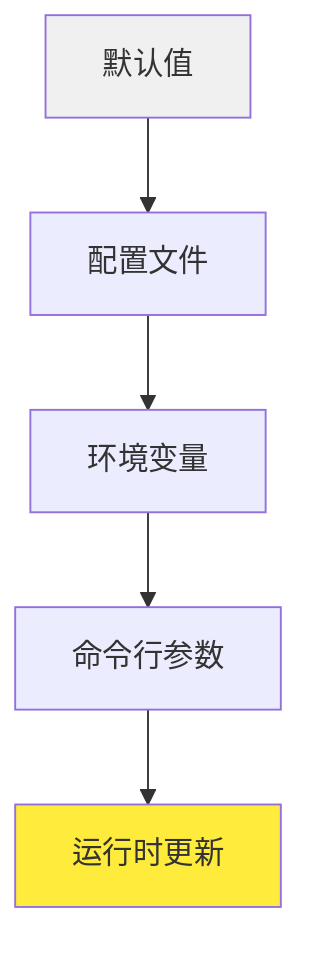

# ⚙️ 配置参考

本文档提供 Sage 多智能体框架配置的完整参考。

## 📋 目录

- [配置层次结构](#-配置层次结构)
- [环境变量](#-环境变量)
- [配置文件](#-配置文件)
- [命令行参数](#-命令行参数)
- [运行时配置](#-运行时配置)
- [模型配置](#-模型配置)
- [智能体配置](#-智能体配置)
- [工具配置](#-工具配置)
- [高级设置](#-高级设置)

## 🏗️ 配置层次结构

Sage 使用分层配置系统，设置按以下顺序应用（后面的值覆盖前面的值）：



1. **默认值**: 代码中的内置默认值
2. **配置文件**: YAML/JSON 配置文件
3. **环境变量**: 系统环境变量
4. **命令行参数**: 命令行参数
5. **运行时更新**: 执行期间的动态更新

## 🌍 环境变量

### 核心设置

| 变量 | 类型 | 默认值 | 描述 |
|------|------|--------|------|
| `OPENAI_API_KEY` | string | None | 模型访问的 OpenAI API 密钥 |
| `SAGE_DEBUG` | boolean | false | 启用调试日志 |
| `SAGE_ENVIRONMENT` | string | "production" | 运行时环境 (development/production) |
| `SAGE_LOG_LEVEL` | string | "INFO" | 日志级别 (DEBUG/INFO/WARNING/ERROR) |
| `SAGE_CONFIG_PATH` | string | "./config" | 配置文件路径 |

### 模型设置

| 变量 | 类型 | 默认值 | 描述 |
|------|------|--------|------|
| `SAGE_MODEL_NAME` | string | "gpt-3.5-turbo" | 默认模型名称 |
| `SAGE_BASE_URL` | string | None | 自定义 API 基础 URL |
| `SAGE_MAX_TOKENS` | integer | 4096 | 每个请求的最大标记数 |
| `SAGE_TEMPERATURE` | float | 0.7 | 模型温度 (0-1) |
| `SAGE_TIMEOUT` | integer | 60 | 请求超时秒数 |

### 智能体设置

| 变量 | 类型 | 默认值 | 描述 |
|------|------|--------|------|
| `SAGE_MAX_ITERATIONS` | integer | 10 | 最大智能体迭代次数 |
| `SAGE_DEEP_THINKING` | boolean | true | 默认启用任务分析 |
| `SAGE_DEEP_RESEARCH` | boolean | true | 默认在流式模式中启用深度研究 |
| `SAGE_SUMMARY_MODE` | boolean | true | 默认生成总结 |
| `SAGE_STREAMING` | boolean | false | 默认启用流式输出 |

### 工具设置

| 变量 | 类型 | 默认值 | 描述 |
|------|------|--------|------|
| `SAGE_TOOLS_PATH` | string | "./agents/tool" | 工具目录路径 |
| `SAGE_MCP_SERVERS_PATH` | string | "./mcp_servers" | MCP 服务器配置路径 |
| `SAGE_TOOL_TIMEOUT` | integer | 30 | 工具执行超时 |
| `SAGE_MAX_CONCURRENT_TOOLS` | integer | 5 | 最大并行工具执行数 |

### 示例 .env 文件

```bash
# Sage 配置的 .env 文件

# API 配置
OPENAI_API_KEY=sk-your-openai-api-key-here
SAGE_BASE_URL=https://api.openai.com/v1

# 模型设置
SAGE_MODEL_NAME=gpt-4
SAGE_MAX_TOKENS=8192
SAGE_TEMPERATURE=0.3

# 智能体行为
SAGE_DEEP_THINKING=true
SAGE_DEEP_RESEARCH=true
SAGE_SUMMARY_MODE=true
SAGE_MAX_ITERATIONS=15

# 开发设置
SAGE_DEBUG=true
SAGE_ENVIRONMENT=development
SAGE_LOG_LEVEL=DEBUG

# 工具设置
SAGE_TOOLS_PATH=/custom/tools:/default/tools
SAGE_TOOL_TIMEOUT=60
```

## 📁 配置文件

### 主配置 (config/settings.yaml)

```yaml
# Sage 多智能体框架配置

model:
  name: "gpt-4"
  base_url: "https://api.openai.com/v1"
  max_tokens: 4096
  temperature: 0.7
  top_p: 1.0
  frequency_penalty: 0.0
  presence_penalty: 0.0
  timeout: 60
  retry_count: 3

agent:
  max_iterations: 10
  deep_thinking: true
  deep_research: true
  summary_mode: true
  streaming: false
  task_analysis:
    enabled: true
    max_depth: 3
  planning:
    enabled: true
    max_subtasks: 20
  execution:
    parallel_tools: true
    max_concurrent: 5
  observation:
    enabled: true
    feedback_threshold: 0.8

tool:
  directories:
    - "./agents/tool"
    - "./custom_tools"
  timeout: 30
  max_concurrent: 5
  retry_count: 2
  mcp_servers:
    config_path: "./mcp_servers/mcp_setting.json"
    auto_connect: true

logging:
  level: "INFO"
  format: "%(asctime)s - %(name)s - %(levelname)s - %(message)s"
  file: "./logs/sage.log"
  rotate: true
  max_size: "10MB"
  backup_count: 5

debug:
  enabled: false
  profile: false
  trace_calls: false
  save_conversations: false
```

### 模型特定配置 (config/models.yaml)

```yaml
# 模型特定配置

models:
  gpt-4:
    max_tokens: 8192
    temperature: 0.3
    best_for: ["复杂推理", "代码生成"]
    
  gpt-3.5-turbo:
    max_tokens: 4096
    temperature: 0.7
    best_for: ["一般聊天", "快速任务"]
    
  mistral-large:
    base_url: "https://api.mistral.ai/v1"
    max_tokens: 32000
    temperature: 0.4
    best_for: ["长上下文", "分析"]
    
  deepseek-chat:
    base_url: "https://api.deepseek.com/v1"
    max_tokens: 8192
    temperature: 0.2
    best_for: ["编程", "数学"]

# 提供商配置
providers:
  openai:
    base_url: "https://api.openai.com/v1"
    models: ["gpt-4", "gpt-3.5-turbo", "gpt-4-turbo"]
    rate_limit: 1000
    
  openrouter:
    base_url: "https://openrouter.ai/api/v1"
    models: ["mistralai/mistral-large", "meta-llama/llama-2-70b-chat"]
    rate_limit: 500
    
  deepseek:
    base_url: "https://api.deepseek.com/v1"
    models: ["deepseek-chat", "deepseek-coder"]
    rate_limit: 100
```

### 工具配置 (config/tools.yaml)

```yaml
# 工具系统配置

tools:
  auto_discovery: true
  directories:
    - "./agents/tool"
    - "./custom_tools"
  
  execution:
    timeout: 30
    max_concurrent: 5
    retry_count: 2
    rate_limit: 100
  
  mcp_servers:
    config_path: "./mcp_servers/mcp_setting.json"
    auto_connect: true
    timeout: 10
    
    servers:
      weather:
        command: "python -m mcp_servers.weather_server"
        port: 8001
        enabled: true
        
      database:
        command: "python -m mcp_servers.database_server"
        port: 8002
        enabled: false
```

## 🖥️ 命令行参数

### 基本用法

```bash
python examples/sage_demo.py [选项]
```

### 可用参数

| 参数 | 类型 | 描述 | 示例 |
|------|------|------|------|
| `--api_key` | string | OpenAI API 密钥 | `--api_key sk-...` |
| `--model` | string | 模型名称 | `--model gpt-4` |
| `--base_url` | string | API 基础 URL | `--base_url https://api.openai.com/v1` |
| `--max_tokens` | integer | 最大标记数 | `--max_tokens 8192` |
| `--temperature` | float | 模型温度 | `--temperature 0.3` |
| `--tools_folders` | list | 工具目录 | `--tools_folders ./tools ./custom` |
| `--config_file` | string | 配置文件路径 | `--config_file ./my_config.yaml` |
| `--debug` | boolean | 启用调试模式 | `--debug` |
| `--streaming` | boolean | 启用流式输出 | `--streaming` |
| `--web` | boolean | 启动网页界面 | `--web` |
| `--port` | integer | 网页界面端口 | `--port 8501` |

### 示例命令

```bash
# 基本用法
python examples/sage_demo.py --api_key sk-your-key

# 高级配置
python examples/sage_demo.py \
  --api_key sk-your-key \
  --model gpt-4 \
  --max_tokens 8192 \
  --temperature 0.3 \
  --debug \
  --streaming

# 自定义工具和配置
python examples/sage_demo.py \
  --api_key sk-your-key \
  --tools_folders ./my_tools ./shared_tools \
  --config_file ./my_config.yaml \
  --web --port 8080

# OpenRouter 使用
python examples/sage_demo.py \
  --api_key sk-or-v1-your-key \
  --base_url https://openrouter.ai/api/v1 \
  --model mistralai/mistral-large
```

## ⚙️ 运行时配置

### 动态配置更新

```python
from agents.config import Settings, update_settings

# 更新配置
update_settings(
    debug=True,
    max_iterations=15,
    temperature=0.2
)

# 获取当前配置
settings = Settings()
print(f"当前模型: {settings.model.name}")
print(f"最大迭代次数: {settings.agent.max_iterations}")
```

### 配置验证

```python
from agents.config import validate_config

# 验证配置字典
config = {
    "model": {"name": "gpt-4", "max_tokens": 8192},
    "agent": {"max_iterations": 10},
    "tool": {"timeout": 30}
}

is_valid, errors = validate_config(config)
if not is_valid:
    print("配置错误:", errors)
```

### 热重载配置

```python
from agents.config import reload_config

# 热重载配置文件
reload_config("./config/settings.yaml")

# 监听配置文件变化
from agents.config import watch_config_file

watch_config_file("./config/settings.yaml", auto_reload=True)
```

## 🤖 模型配置

### 支持的模型

```python
# OpenAI 模型
"gpt-4"
"gpt-4-turbo"
"gpt-3.5-turbo"

# OpenRouter 模型
"mistralai/mistral-large"
"meta-llama/llama-2-70b-chat"
"anthropic/claude-3-sonnet"

# DeepSeek 模型
"deepseek-chat"
"deepseek-coder"

# 本地模型（通过 Ollama）
"llama2:7b"
"mistral:7b"
```

### 模型特定设置

```python
model_configs = {
    "gpt-4": {
        "max_tokens": 8192,
        "temperature": 0.3,
        "top_p": 0.9,
        "streaming": True
    },
    "mistral-large": {
        "max_tokens": 32000,
        "temperature": 0.4,
        "stop_sequences": ["Human:", "Assistant:"]
    }
}
```

### 自定义模型提供商

```python
from agents.config import register_provider

# 注册自定义提供商
register_provider(
    name="custom_provider",
    base_url="https://api.custom.com/v1",
    api_key_env="CUSTOM_API_KEY",
    models=["custom-model-1", "custom-model-2"]
)
```

## 🤖 智能体配置

### 智能体行为设置

```yaml
agent:
  task_analysis:
    enabled: true
    max_depth: 3
    complexity_threshold: 0.7
    
  planning:
    enabled: true
    max_subtasks: 20
    parallel_execution: true
    dependency_tracking: true
    
  execution:
    parallel_tools: true
    max_concurrent: 5
    timeout: 300
    retry_failed_tools: true
    
  observation:
    enabled: true
    feedback_threshold: 0.8
    completion_criteria: "all_objectives_met"
    
  summary:
    enabled: true
    include_steps: true
    include_metrics: true
    format: "structured"
```

### 自定义智能体配置

```python
from agents.config import register_agent

# 注册自定义智能体
register_agent(
    name="custom_researcher",
    class_path="my_agents.CustomResearchAgent",
    config={
        "max_research_depth": 5,
        "sources": ["academic", "web", "internal"],
        "output_format": "report"
    }
)
```

## 🛠️ 工具配置

### 工具发现和注册

```yaml
tool:
  auto_discovery: true
  directories:
    - "./agents/tool"
    - "./custom_tools"
    - "~/shared_tools"
  
  filters:
    include_patterns: ["*.py", "*.json"]
    exclude_patterns: ["*test*", "*demo*"]
    
  validation:
    strict_typing: true
    require_docstrings: true
    check_dependencies: true
```

### MCP 服务器配置

```yaml
mcp_servers:
  config_path: "./mcp_servers/mcp_setting.json"
  auto_connect: true
  connection_timeout: 10
  request_timeout: 30
  
  servers:
    weather:
      command: "python -m mcp_servers.weather_server"
      port: 8001
      enabled: true
      health_check: "/health"
      
    database:
      command: "node mcp_servers/database_server.js"
      port: 8002
      enabled: false
      environment:
        DB_HOST: "localhost"
        DB_PORT: "5432"
```

### 工具安全设置

```yaml
tool_security:
  sandbox_mode: true
  allowed_modules:
    - "requests"
    - "json"
    - "datetime"
  blocked_modules:
    - "os"
    - "subprocess"
    - "sys"
  
  resource_limits:
    max_memory: "256MB"
    max_execution_time: 30
    max_file_size: "10MB"
```

## 🔧 高级设置

### 性能调优

```yaml
performance:
  caching:
    enabled: true
    ttl: 3600
    max_size: "100MB"
    
  memory:
    max_history_length: 100
    cleanup_interval: 300
    gc_threshold: 0.8
    
  concurrency:
    max_workers: 10
    thread_pool_size: 20
    async_enabled: true
```

### 安全配置

```yaml
security:
  api_key_rotation: true
  request_signing: false
  rate_limiting:
    enabled: true
    requests_per_minute: 60
    burst_limit: 10
    
  input_validation:
    max_input_length: 10000
    sanitize_html: true
    block_code_execution: true
```

### 监控和日志

```yaml
monitoring:
  metrics:
    enabled: true
    export_interval: 60
    include_system_metrics: true
    
  alerts:
    error_rate_threshold: 0.1
    response_time_threshold: 5.0
    email_notifications: true
    
logging:
  level: "INFO"
  format: "json"
  file: "./logs/sage.log"
  rotation:
    max_size: "10MB"
    backup_count: 5
    
  structured_logging: true
  include_context: true
  sensitive_data_filtering: true
```

### 开发配置

```yaml
development:
  hot_reload: true
  auto_save_conversations: true
  debug_toolbar: true
  
  testing:
    mock_external_apis: true
    test_data_path: "./test_data"
    coverage_reporting: true
    
  profiling:
    enabled: false
    output_path: "./profiles"
    memory_profiling: false
```

## 📱 环境特定配置

### 开发环境

```yaml
# config/development.yaml
environment: development
debug: true
logging:
  level: DEBUG
model:
  temperature: 0.8
agent:
  max_iterations: 5
```

### 生产环境

```yaml
# config/production.yaml
environment: production
debug: false
logging:
  level: INFO
  file: "/var/log/sage/sage.log"
security:
  rate_limiting:
    enabled: true
performance:
  caching:
    enabled: true
```

### 测试环境

```yaml
# config/testing.yaml
environment: testing
debug: true
model:
  name: "gpt-3.5-turbo"  # 使用较便宜的模型进行测试
  max_tokens: 1000
testing:
  mock_external_apis: true
```

## 🔍 配置故障排除

### 常见问题

1. **配置不生效**
   ```bash
   # 检查配置优先级
   python -c "from agents.config import get_settings; print(get_settings())"
   ```

2. **环境变量未识别**
   ```bash
   # 验证环境变量
   env | grep SAGE_
   ```

3. **配置文件错误**
   ```bash
   # 验证YAML语法
   python -c "import yaml; yaml.safe_load(open('config/settings.yaml'))"
   ```

### 调试配置

```python
from agents.config import debug_config

# 打印完整配置
debug_config()

# 检查配置来源
from agents.config import get_config_sources
sources = get_config_sources()
print("配置来源:", sources)
```

这份完整的配置参考应该能帮助您充分定制 Sage 多智能体框架以满足您的需求。 