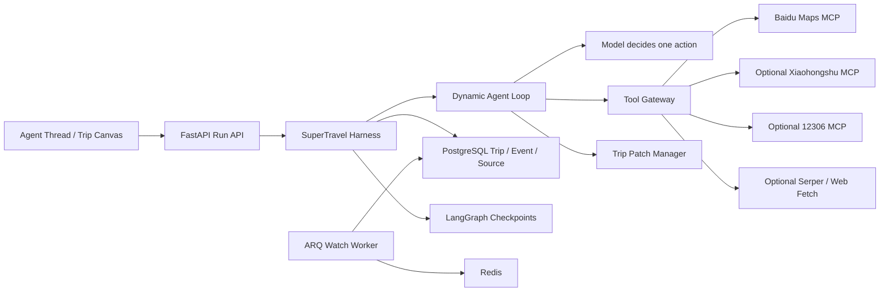

# SuperTravel MVP 架构与业务实现

## 1. 系统边界

SuperTravel 对外只有一个旅行管家。对话负责意图、研究说明和决策；Trip State 是业务事实源；时间线负责时间结构；地图负责空间结构。



LangGraph 只提供一次 Run 的耐久循环、中断和恢复。`Trip.current_version`、TripSpec、PlanVersion、PlanPatch、来源与业务事实保存在普通 PostgreSQL 表中，Graph State 不能覆盖 Trip State。

## 2. 动态 Agent Loop

原先按目的地、日期、预算等字段固定串联的 27 节点工作流已经删除。当前主图只有七个通用节点：

```text
bootstrap
→ model_decide
  ├─ execute_tools ────┐
  ├─ wait_user ────────┤
  ├─ validate_patch ───┤
  ├─ stream_response ──┤
  └─ finish            │
       ▲               │
       └── bootstrap ◀─┘
```

模型每轮只能选择一个受 Schema 约束的 `AgentAction`：询问用户、调用只读工具、更新本轮工作计划、提出 Trip Patch、回答或结束。Harness 负责工具白名单、最大迭代/调用次数、组件中断、确定性校验、Patch 审批、状态提交和公开事件。

## 3. 澄清、研究与规划

1. `POST /api/agent/turns` 总是绑定明确的 Trip、Thread 和独立 Run。
2. 首页发起请求是新 Trip 边界，不会续接此前打开的对话。
3. 模型可从用户原文提议 TripSpec 更新；只有携带原文证据的字段才能成为 `CONFIRMED`，目的地仍须百度地图核验。
4. 宽泛目的地先比较区域或提出高信息价值问题，不静默收敛到默认城市。
5. 生成首版计划前强制确认具体目的地、日期、同行人和体力/饮食/无障碍等硬约束。
6. Agent 自主选择百度地图、网页、小红书或铁路只读工具，工具结果回到循环后由模型重新判断。
7. 排程只能引用真实 Provider Place ID；规划器逐段调用真实路线，路线缺失会形成阻断。
8. 首版计划与高影响修改都先产生预览组件，用户确认后才创建 PlanVersion。

## 4. 公开工作过程与来源

前端 SSE 只接收产品级事件：

```text
run.*
progress.*
tool.started / tool.completed / tool.failed
source.discovered
question.*
component.*
trip.*
message.delta / message.completed
```

模型原始输出、隐藏推理、Prompt、JSON Schema、token 和底层请求不会出现在前端 API。工作过程只展示自然语言任务说明、工具名称、可读查询、实际结果条目和来源。

每个外部来源保存为 `SourceRecord`，记录运行、工具调用、类型、标题、真实 URL、发布者、抓取时间、摘要和可信度。最终回答只能引用当前 Run 已保存的 SourceRecord ID，浏览器再将其渲染为真实链接。小红书仅作为社区体验线索，不能单独证明开放时间、票价、政策或余票。

## 5. 计划修改与安全

所有高影响修改都产生 `PlanPatch(base_version)`：

- 模型只提出受约束的 ADD/REMOVE/MOVE/REPLACE/UPDATE；
- REPLACE 必须重新搜索真实地点；
- 已完成、锁定或已预约项目在服务层再次拒绝修改；
- 受影响日期重建真实 RouteLeg 并重新执行 Validator；
- 用户确认时同时校验 Trip 行锁与 `base_version`；
- 撤销通过历史快照创建新版本，旧版本不可变。

支付、预订、退款和订单修改不在 MVP 工具白名单中。

## 6. 对话与恢复

- Conversation Thread 的消息、组件、Run、Event、ToolCall 和 SourceRecord 完全隔离；
- 新建、切换、重命名、归档和删除均为真实数据库操作；
- 删除 Thread 会级联删除运行记录，并显式清理对应 LangGraph Checkpoint；
- 组件提交带幂等键，同一组件只应用一次；
- 用户用新文字回答时，旧的待处理组件进入 `SUPERSEDED`；
- SSE 通过持久 sequence 与 `Last-Event-ID` 重放；
- 服务重启后，等待中的组件可从 PostgreSQL Checkpoint 恢复同一 Run。

## 7. 当前暂不进入主链路

Skill Registry、RAG、自动长期记忆、子 Agent 编排、图片/链接导入、酒店价格与预订、支付、多人协作和 Review 暂不进入本次 MVP。旧知识表可保留用于未来迁移，但 API 不加载 embedding 模型，也不会在 Agent 主流程中检索向量资料。
