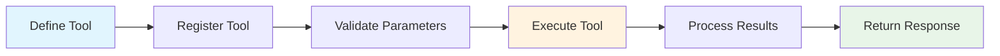

{: .note }
> Looking for the Chinese version? Check out [工具开发指南](TOOL_DEVELOPMENT_CN.html)

## Table of Contents
{: .no_toc .text-delta }

1. TOC
{:toc}

# 🛠️ Tool Development Guide

This guide covers everything you need to know about developing custom tools for Sage Multi-Agent Framework.

## 📋 Table of Contents

- [Tool System Overview](#-tool-system-overview)
- [Creating Basic Tools](#-creating-basic-tools)
- [Advanced Tool Features](#-advanced-tool-features)
- [MCP Tool Integration](#-mcp-tool-integration)
- [Agent Tools](#-agent-tools)
- [Testing and Debugging](#-testing-and-debugging)
- [Best Practices](#-best-practices)
- [Deployment](#-deployment)

## 🎯 Tool System Overview

Sage supports three types of tools:

1. **Local Tools**: Python functions that run in the same process
2. **MCP Tools**: External tools that communicate via MCP protocol
3. **Agent Tools**: Specialized tools that delegate to other agents

### Tool Lifecycle



## 🔧 Creating Basic Tools

### Simple Function Tool

```python
from agents.tool.tool_base import ToolBase

@ToolBase.register_tool
def calculator(expression: str) -> str:
    """
    Evaluate mathematical expressions safely
    
    Args:
        expression: Mathematical expression to evaluate (e.g., "2 + 3 * 4")
        
    Returns:
        str: Result of the calculation
        
    Examples:
        calculator("2 + 3") -> "5"
        calculator("sqrt(16)") -> "4.0"
    """
    import math
    import re
    
    # Whitelist allowed operations
    allowed_chars = set('0123456789+-*/().sqrt()pow()log()sin()cos()tan() ')
    if not all(c in allowed_chars for c in expression):
        return "Error: Invalid characters in expression"
    
    try:
        # Create safe evaluation environment
        safe_dict = {
            "__builtins__": {},
            "sqrt": math.sqrt,
            "pow": math.pow,
            "log": math.log,
            "sin": math.sin,
            "cos": math.cos,
            "tan": math.tan,
        }
        
        result = eval(expression, safe_dict)
        return str(result)
    except Exception as e:
        return f"Error: {str(e)}"
```

### Class-based Tool

```python
from agents.tool.tool_base import ToolBase
from typing import Dict, List
import requests

class WeatherTool:
    """Weather information tool"""
    
    def __init__(self):
        self.api_key = os.getenv('WEATHER_API_KEY')
        self.base_url = "http://api.openweathermap.org/data/2.5/weather"
    
    @ToolBase.register_tool
    def get_weather(self, city: str, units: str = "metric") -> Dict[str, Any]:
        """
        Get current weather information for a city
        
        Args:
            city: Name of the city (e.g., "London", "New York")
            units: Temperature units - "metric" (Celsius), "imperial" (Fahrenheit), or "kelvin"
            
        Returns:
            Dict containing weather data including temperature, humidity, description
        """
        if not self.api_key:
            return {"error": "Weather API key not configured"}
        
        params = {
            'q': city,
            'appid': self.api_key,
            'units': units
        }
        
        try:
            response = requests.get(self.base_url, params=params, timeout=10)
            response.raise_for_status()
            data = response.json()
            
            return {
                "city": data['name'],
                "country": data['sys']['country'],
                "temperature": data['main']['temp'],
                "feels_like": data['main']['feels_like'],
                "humidity": data['main']['humidity'],
                "description": data['weather'][0]['description'],
                "units": units
            }
        except requests.RequestException as e:
            return {"error": f"Failed to fetch weather data: {str(e)}"}
        except KeyError as e:
            return {"error": f"Unexpected response format: {str(e)}"}

# Initialize the tool
weather_tool = WeatherTool()
```

### Tool with Configuration

```python
from agents.tool.tool_base import ToolBase
from agents.config import get_settings
from dataclasses import dataclass
from typing import Optional

@dataclass
class DatabaseConfig:
    host: str = "localhost"
    port: int = 5432
    database: str = "sage_db"
    timeout: int = 30

class DatabaseTool:
    """Database query tool with configuration"""
    
    def __init__(self):
        self.config = DatabaseConfig()
        settings = get_settings()
        
        # Override with environment variables
        self.config.host = os.getenv('DB_HOST', self.config.host)
        self.config.port = int(os.getenv('DB_PORT', self.config.port))
    
    @ToolBase.register_tool
    def query_database(self, query: str, limit: int = 100) -> Dict[str, Any]:
        """
        Execute a read-only database query
        
        Args:
            query: SQL SELECT query to execute
            limit: Maximum number of rows to return (default: 100)
            
        Returns:
            Dict containing query results or error information
        """
        # Validate query is read-only
        query_lower = query.lower().strip()
        if not query_lower.startswith('select'):
            return {"error": "Only SELECT queries are allowed"}
        
        # Add safety checks
        dangerous_keywords = ['drop', 'delete', 'update', 'insert', 'alter']
        if any(keyword in query_lower for keyword in dangerous_keywords):
            return {"error": "Query contains potentially dangerous operations"}
        
        try:
            # Your database connection logic here
            # This is a placeholder implementation
            results = self._execute_query(query, limit)
            return {
                "success": True,
                "row_count": len(results),
                "data": results
            }
        except Exception as e:
            return {"error": f"Query execution failed: {str(e)}"}
    
    def _execute_query(self, query: str, limit: int) -> List[Dict]:
        """Execute the actual query (implement with your DB library)"""
        # Placeholder - implement with your preferred database library
        return [{"example": "data"}]
```

## 🚀 Advanced Tool Features

### Tool with File Operations

```python
import tempfile
import shutil
from pathlib import Path

@ToolBase.register_tool
def process_file(file_content: str, operation: str = "analyze") -> Dict[str, Any]:
    """
    Process file content with various operations
    
    Args:
        file_content: Content of the file to process
        operation: Operation to perform - "analyze", "format", "validate"
        
    Returns:
        Dict containing processing results
    """
    # Create temporary file for processing
    with tempfile.NamedTemporaryFile(mode='w', suffix='.txt', delete=False) as temp_file:
        temp_file.write(file_content)
        temp_path = Path(temp_file.name)
    
    try:
        if operation == "analyze":
            return _analyze_file(temp_path)
        elif operation == "format":
            return _format_file(temp_path)
        elif operation == "validate":
            return _validate_file(temp_path)
        else:
            return {"error": f"Unknown operation: {operation}"}
    finally:
        # Cleanup temporary file
        temp_path.unlink(missing_ok=True)

def _analyze_file(file_path: Path) -> Dict[str, Any]:
    """Analyze file content"""
    content = file_path.read_text()
    return {
        "line_count": len(content.splitlines()),
        "char_count": len(content),
        "word_count": len(content.split()),
        "size_bytes": file_path.stat().st_size
    }
```

### Async Tool Support

```python
import asyncio
import aiohttp

@ToolBase.register_tool
def fetch_url_async(url: str, timeout: int = 30) -> Dict[str, Any]:
    """
    Fetch URL content asynchronously
    
    Args:
        url: URL to fetch
        timeout: Request timeout in seconds
        
    Returns:
        Dict containing response data or error
    """
    # Run async function in sync context
    return asyncio.run(_fetch_url_internal(url, timeout))

async def _fetch_url_internal(url: str, timeout: int) -> Dict[str, Any]:
    """Internal async implementation"""
    try:
        async with aiohttp.ClientSession() as session:
            async with session.get(url, timeout=timeout) as response:
                content = await response.text()
                return {
                    "url": url,
                    "status_code": response.status,
                    "content_length": len(content),
                    "content": content[:1000] + "..." if len(content) > 1000 else content
                }
    except asyncio.TimeoutError:
        return {"error": f"Request timed out after {timeout} seconds"}
    except Exception as e:
        return {"error": f"Failed to fetch URL: {str(e)}"}
```

### Tool with Progress Tracking

```python
from agents.utils import logger

@ToolBase.register_tool
def process_large_dataset(data: List[Dict], operation: str = "transform") -> Dict[str, Any]:
    """
    Process large dataset with progress tracking
    
    Args:
        data: List of data items to process
        operation: Processing operation to perform
        
    Returns:
        Dict containing processing results
    """
    total_items = len(data)
    processed_items = []
    errors = []
    
    logger.info(f"Starting processing of {total_items} items")
    
    for i, item in enumerate(data):
        try:
            # Process individual item
            result = _process_item(item, operation)
            processed_items.append(result)
            
            # Log progress every 10%
            if (i + 1) % max(1, total_items // 10) == 0:
                progress = ((i + 1) / total_items) * 100
                logger.info(f"Progress: {progress:.1f}% ({i + 1}/{total_items})")
                
        except Exception as e:
            error_info = {
                "item_index": i,
                "item": item,
                "error": str(e)
            }
            errors.append(error_info)
            logger.warning(f"Error processing item {i}: {str(e)}")
    
    logger.info(f"Processing complete. Success: {len(processed_items)}, Errors: {len(errors)}")
    
    return {
        "total_items": total_items,
        "processed_count": len(processed_items),
        "error_count": len(errors),
        "results": processed_items,
        "errors": errors
    }

def _process_item(item: Dict, operation: str) -> Dict:
    """Process individual item"""
    # Your processing logic here
    return {"processed": True, "original": item}
```

## 🌐 MCP Tool Integration

### Setting up MCP Server

```json
// mcp_servers/mcp_setting.json
{
  "servers": {
    "filesystem": {
      "command": "npx",
      "args": ["-y", "@modelcontextprotocol/server-filesystem", "/tmp"],
      "connection_type": "stdio"
    },
    "web_search": {
      "command": "python",
      "args": ["-m", "mcp_servers.web_search"],
      "connection_type": "stdio",
      "env": {
        "SEARCH_API_KEY": "your-api-key"
      }
    }
  }
}
```

### Custom MCP Server

```python
# mcp_servers/custom_server.py
import asyncio
from mcp.server import Server
from mcp.types import Tool, TextContent

app = Server("custom-tools")

@app.list_tools()
async def list_tools() -> list[Tool]:
    """List available tools"""
    return [
        Tool(
            name="custom_processor",
            description="Process data with custom algorithm",
            inputSchema={
                "type": "object",
                "properties": {
                    "data": {"type": "string", "description": "Data to process"},
                    "algorithm": {"type": "string", "description": "Algorithm to use"}
                },
                "required": ["data"]
            }
        )
    ]

@app.call_tool()
async def call_tool(name: str, arguments: dict) -> list[TextContent]:
    """Execute tool"""
    if name == "custom_processor":
        data = arguments.get("data", "")
        algorithm = arguments.get("algorithm", "default")
        
        # Your custom processing logic
        result = f"Processed '{data}' with {algorithm} algorithm"
        
        return [TextContent(type="text", text=result)]
    
    raise ValueError(f"Unknown tool: {name}")

if __name__ == "__main__":
    # Run the server
    import mcp.server.stdio
    asyncio.run(mcp.server.stdio.run(app))
```

### Testing MCP Integration

```python
# test_mcp_integration.py
from agents.tool.tool_manager import ToolManager

def test_mcp_tools():
    """Test MCP tool integration"""
    tool_manager = ToolManager()
    
    # List available MCP tools
    mcp_tools = [tool for tool in tool_manager.list_tools() 
                 if hasattr(tool, 'server_name')]
    
    print(f"Found {len(mcp_tools)} MCP tools:")
    for tool in mcp_tools:
        print(f"- {tool.name}: {tool.description}")
    
    # Test a specific tool
    if mcp_tools:
        tool_name = mcp_tools[0].name
        result = tool_manager.run_tool(
            tool_name,
            messages=[],
            session_id="test",
            data="test data"
        )
        print(f"Tool result: {result}")

if __name__ == "__main__":
    test_mcp_tools()
```

## 🤖 Agent Tools

### Creating Agent Tools

```python
from agents.tool.tool_base import AgentToolSpec
from agents.agent.agent_base import AgentBase

class ResearchAgent(AgentBase):
    """Specialized research agent"""
    
    def run(self, messages, tool_manager=None, **kwargs):
        """Perform research tasks"""
        # Your research logic here
        return [{
            "role": "assistant",
            "content": "Research completed",
            "type": "normal"
        }]

# Register as agent tool
@ToolBase.register_agent_tool
def research_assistant(messages: List[Dict], session_id: str) -> List[Dict]:
    """
    Delegate complex research tasks to specialized research agent
    
    Args:
        messages: Conversation history
        session_id: Current session ID
        
    Returns:
        List of response messages from research agent
    """
    research_agent = ResearchAgent()
    return research_agent.run(messages, session_id=session_id)
```

## 🧪 Testing and Debugging

### Unit Testing Tools

```python
# tests/test_tools.py
import pytest
from agents.tool.tool_manager import ToolManager

class TestCustomTools:
    """Test suite for custom tools"""
    
    def setup_method(self):
        """Setup test environment"""
        self.tool_manager = ToolManager()
    
    def test_calculator_tool(self):
        """Test calculator tool"""
        result = self.tool_manager.run_tool(
            "calculator",
            messages=[],
            session_id="test",
            expression="2 + 3"
        )
        assert "5" in result
    
    def test_calculator_error_handling(self):
        """Test calculator error handling"""
        result = self.tool_manager.run_tool(
            "calculator", 
            messages=[],
            session_id="test",
            expression="invalid_expression"
        )
        assert "Error" in result
    
    @pytest.mark.asyncio
    async def test_async_tool(self):
        """Test async tool execution"""
        result = self.tool_manager.run_tool(
            "fetch_url_async",
            messages=[],
            session_id="test",
            url="https://httpbin.org/json"
        )
        assert "error" not in result.lower()

def test_tool_registration():
    """Test tool registration process"""
    tool_manager = ToolManager()
    initial_count = len(tool_manager.list_tools())
    
    @ToolBase.register_tool
    def test_tool(param: str) -> str:
        return f"Test: {param}"
    
    # Tool should be automatically registered
    final_count = len(tool_manager.list_tools())
    assert final_count == initial_count + 1
```

### Debug Mode

```python
# Enable debug logging for tools
import os
os.environ['SAGE_DEBUG'] = 'true'

# Test tool with debug output
from agents.tool.tool_manager import ToolManager

tool_manager = ToolManager()
result = tool_manager.run_tool(
    "your_tool_name",
    messages=[],
    session_id="debug",
    **your_parameters
)
print(f"Debug result: {result}")
```

## ✅ Best Practices

### 1. Error Handling

```python
@ToolBase.register_tool
def robust_tool(param: str) -> Dict[str, Any]:
    """Tool with comprehensive error handling"""
    try:
        # Validate input
        if not param or not isinstance(param, str):
            return {"error": "Invalid parameter: param must be a non-empty string"}
        
        # Process input
        result = process_data(param)
        
        # Validate output
        if result is None:
            return {"error": "Processing failed: no result generated"}
        
        return {"success": True, "result": result}
        
    except ValueError as e:
        return {"error": f"Invalid input: {str(e)}"}
    except Exception as e:
        logger.error(f"Unexpected error in robust_tool: {str(e)}")
        return {"error": "An unexpected error occurred"}
```

### 2. Input Validation

```python
from typing import Union, List
import re

def validate_email(email: str) -> bool:
    """Validate email format"""
    pattern = r'^[a-zA-Z0-9._%+-]+@[a-zA-Z0-9.-]+\.[a-zA-Z]{2,}$'
    return re.match(pattern, email) is not None

@ToolBase.register_tool
def send_email(to: str, subject: str, body: str) -> Dict[str, Any]:
    """
    Send email with validation
    
    Args:
        to: Recipient email address
        subject: Email subject line
        body: Email body content
    """
    # Validate inputs
    if not validate_email(to):
        return {"error": "Invalid email address format"}
    
    if not subject.strip():
        return {"error": "Subject cannot be empty"}
    
    if len(body) > 10000:
        return {"error": "Email body too long (max 10,000 characters)"}
    
    # Your email sending logic here
    return {"success": True, "message": "Email sent successfully"}
```

### 3. Resource Management

```python
import contextlib
import tempfile
from pathlib import Path

@contextlib.contextmanager
def temporary_workspace():
    """Context manager for temporary workspace"""
    workspace = Path(tempfile.mkdtemp(prefix="sage_tool_"))
    try:
        yield workspace
    finally:
        shutil.rmtree(workspace, ignore_errors=True)

@ToolBase.register_tool
def process_files(files: List[str]) -> Dict[str, Any]:
    """Process files with proper resource management"""
    with temporary_workspace() as workspace:
        try:
            results = []
            for file_content in files:
                # Process each file in temporary workspace
                temp_file = workspace / f"file_{len(results)}.txt"
                temp_file.write_text(file_content)
                
                # Process file
                result = analyze_file(temp_file)
                results.append(result)
            
            return {"success": True, "results": results}
        except Exception as e:
            return {"error": f"File processing failed: {str(e)}"}
```

### 4. Performance Optimization

```python
from functools import lru_cache
import time

class OptimizedTool:
    """Tool with performance optimizations"""
    
    @lru_cache(maxsize=128)
    def _expensive_computation(self, data: str) -> str:
        """Cache expensive computations"""
        # Simulate expensive operation
        time.sleep(1)
        return f"processed_{data}"
    
    @ToolBase.register_tool
    def optimized_processor(self, data: str, use_cache: bool = True) -> Dict[str, Any]:
        """
        Process data with optional caching
        
        Args:
            data: Data to process
            use_cache: Whether to use result caching
        """
        start_time = time.time()
        
        if use_cache:
            result = self._expensive_computation(data)
        else:
            result = f"processed_{data}"
            time.sleep(1)  # Simulate work
        
        processing_time = time.time() - start_time
        
        return {
            "result": result,
            "processing_time": processing_time,
            "cache_used": use_cache
        }

# Initialize optimized tool
optimized_tool = OptimizedTool()
```

## 🚀 Deployment

### Tool Distribution

```python
# setup.py for tool package
from setuptools import setup, find_packages

setup(
    name="sage-custom-tools",
    version="1.0.0",
    packages=find_packages(),
    install_requires=[
        "sage-multi-agent>=1.0.0",
        "requests>=2.25.0",
        # Other dependencies
    ],
    entry_points={
        "sage.tools": [
            "weather = custom_tools.weather:WeatherTool",
            "database = custom_tools.database:DatabaseTool",
        ]
    }
)
```

### Environment Configuration

```bash
# .env file for tool configuration
WEATHER_API_KEY=your_weather_api_key
DB_HOST=localhost
DB_PORT=5432
DB_NAME=sage_tools
CUSTOM_TOOL_DEBUG=true
```

### Docker Deployment

```dockerfile
# Dockerfile for tool deployment
FROM python:3.9-slim

WORKDIR /app

COPY requirements.txt .
RUN pip install -r requirements.txt

COPY custom_tools/ ./custom_tools/
COPY mcp_servers/ ./mcp_servers/

ENV SAGE_TOOLS_PATH=/app/custom_tools
ENV MCP_SERVERS_PATH=/app/mcp_servers

CMD ["python", "-m", "sage.tools.server"]
```

## 📚 Tool Examples Repository

Check out our collection of example tools:

- **[Data Processing Tools](examples/tools/data_processing/)**: CSV, JSON, XML processors
- **[Web Tools](examples/tools/web/)**: URL fetching, web scraping, API clients
- **[File Tools](examples/tools/files/)**: File operations, format conversions
- **[Utility Tools](examples/tools/utilities/)**: Date/time, string processing, validation

## 🤝 Contributing Tools

To contribute tools to the Sage ecosystem:

1. Fork the repository
2. Create tools following these guidelines
3. Add comprehensive tests
4. Update documentation
5. Submit a pull request

### Tool Submission Checklist

- [ ] Clear tool description and documentation
- [ ] Input validation and error handling
- [ ] Unit tests with good coverage
- [ ] Performance considerations addressed
- [ ] Security review completed
- [ ] Example usage provided

Happy tool building! 🛠️ 