# 🛠️ 工具开发指南

本指南涵盖了为 Sage 多智能体框架开发自定义工具所需的一切知识。

## 📋 目录

- [工具系统概览](#-工具系统概览)
- [创建基础工具](#-创建基础工具)
- [高级工具功能](#-高级工具功能)
- [MCP 工具集成](#-mcp-工具集成)
- [智能体工具](#-智能体工具)
- [测试和调试](#-测试和调试)
- [最佳实践](#-最佳实践)
- [部署](#-部署)

## 🎯 工具系统概览

Sage 支持三种类型的工具：

1. **本地工具**: 在同一进程中运行的 Python 函数
2. **MCP 工具**: 通过 MCP 协议通信的外部工具
3. **智能体工具**: 委托给其他智能体的专门工具

### 工具生命周期

```mermaid
graph LR
    A[定义工具] --> B[注册工具]
    B --> C[验证参数]
    C --> D[执行工具]
    D --> E[处理结果]
    E --> F[返回响应]
    
    style A fill:#e1f5fe
    style D fill:#fff3e0
    style F fill:#e8f5e8
```



## 🔧 创建基础工具

### 简单函数工具

```python
from agents.tool.tool_base import ToolBase

@ToolBase.register_tool
def calculator(expression: str) -> str:
    """
    安全地计算数学表达式
    
    Args:
        expression: 要计算的数学表达式（例如："2 + 3 * 4"）
        
    Returns:
        str: 计算结果
        
    Examples:
        calculator("2 + 3") -> "5"
        calculator("sqrt(16)") -> "4.0"
    """
    import math
    import re
    
    # 允许的操作白名单
    allowed_chars = set('0123456789+-*/().sqrt()pow()log()sin()cos()tan() ')
    if not all(c in allowed_chars for c in expression):
        return "错误: 表达式中包含无效字符"
    
    try:
        # 创建安全的计算环境
        safe_dict = {
            "__builtins__": {},
            "sqrt": math.sqrt,
            "pow": math.pow,
            "log": math.log,
            "sin": math.sin,
            "cos": math.cos,
            "tan": math.tan,
        }
        
        result = eval(expression, safe_dict)
        return str(result)
    except Exception as e:
        return f"错误: {str(e)}"
```

### 基于类的工具

```python
from agents.tool.tool_base import ToolBase
from typing import Dict, List
import requests
import os

class WeatherTool:
    """天气信息工具"""
    
    def __init__(self):
        self.api_key = os.getenv('WEATHER_API_KEY')
        self.base_url = "http://api.openweathermap.org/data/2.5/weather"
    
    @ToolBase.register_tool
    def get_weather(self, city: str, units: str = "metric") -> Dict[str, Any]:
        """
        获取城市的当前天气信息
        
        Args:
            city: 城市名称（例如："北京"、"上海"）
            units: 温度单位 - "metric"（摄氏度）、"imperial"（华氏度）或 "kelvin"
            
        Returns:
            包含天气数据的字典，包括温度、湿度、描述等
        """
        if not self.api_key:
            return {"error": "未配置天气 API 密钥"}
        
        params = {
            'q': city,
            'appid': self.api_key,
            'units': units
        }
        
        try:
            response = requests.get(self.base_url, params=params, timeout=10)
            response.raise_for_status()
            data = response.json()
            
            return {
                "city": data['name'],
                "country": data['sys']['country'],
                "temperature": data['main']['temp'],
                "feels_like": data['main']['feels_like'],
                "humidity": data['main']['humidity'],
                "description": data['weather'][0]['description'],
                "units": units
            }
        except requests.RequestException as e:
            return {"error": f"获取天气数据失败: {str(e)}"}
        except KeyError as e:
            return {"error": f"响应格式异常: {str(e)}"}

# 初始化工具
weather_tool = WeatherTool()
```

### 带配置的工具

```python
from agents.tool.tool_base import ToolBase
from agents.config import get_settings
from dataclasses import dataclass
from typing import Optional, Dict, Any, List

@dataclass
class DatabaseConfig:
    host: str = "localhost"
    port: int = 5432
    database: str = "sage_db"
    timeout: int = 30

class DatabaseTool:
    """带配置的数据库查询工具"""
    
    def __init__(self):
        self.config = DatabaseConfig()
        settings = get_settings()
        
        # 使用环境变量覆盖
        self.config.host = os.getenv('DB_HOST', self.config.host)
        self.config.port = int(os.getenv('DB_PORT', self.config.port))
    
    @ToolBase.register_tool
    def query_database(self, query: str, limit: int = 100) -> Dict[str, Any]:
        """
        执行只读数据库查询
        
        Args:
            query: 要执行的 SQL SELECT 查询
            limit: 返回的最大行数（默认：100）
            
        Returns:
            包含查询结果或错误信息的字典
        """
        # 验证查询是否为只读
        query_lower = query.lower().strip()
        if not query_lower.startswith('select'):
            return {"error": "只允许 SELECT 查询"}
        
        # 添加安全检查
        dangerous_keywords = ['drop', 'delete', 'update', 'insert', 'alter']
        if any(keyword in query_lower for keyword in dangerous_keywords):
            return {"error": "查询包含潜在危险操作"}
        
        try:
            # 您的数据库连接逻辑在这里
            # 这是一个占位符实现
            results = self._execute_query(query, limit)
            return {
                "success": True,
                "row_count": len(results),
                "data": results
            }
        except Exception as e:
            return {"error": f"查询执行失败: {str(e)}"}
    
    def _execute_query(self, query: str, limit: int) -> List[Dict]:
        """执行实际查询（使用您首选的数据库库实现）"""
        # 占位符 - 使用您首选的数据库库实现
        return [{"example": "data"}]
```

## 🚀 高级工具功能

### 带文件操作的工具

```python
import tempfile
import shutil
from pathlib import Path

@ToolBase.register_tool
def process_file(file_content: str, operation: str = "analyze") -> Dict[str, Any]:
    """
    使用各种操作处理文件内容
    
    Args:
        file_content: 要处理的文件内容
        operation: 要执行的操作 - "analyze"、"format"、"validate"
        
    Returns:
        包含处理结果的字典
    """
    # 创建临时文件进行处理
    with tempfile.NamedTemporaryFile(mode='w', suffix='.txt', delete=False) as temp_file:
        temp_file.write(file_content)
        temp_path = Path(temp_file.name)
    
    try:
        if operation == "analyze":
            return _analyze_file(temp_path)
        elif operation == "format":
            return _format_file(temp_path)
        elif operation == "validate":
            return _validate_file(temp_path)
        else:
            return {"error": f"未知操作: {operation}"}
    finally:
        # 清理临时文件
        temp_path.unlink(missing_ok=True)

def _analyze_file(file_path: Path) -> Dict[str, Any]:
    """分析文件内容"""
    content = file_path.read_text()
    return {
        "line_count": len(content.splitlines()),
        "char_count": len(content),
        "word_count": len(content.split()),
        "size_bytes": file_path.stat().st_size
    }

def _format_file(file_path: Path) -> Dict[str, Any]:
    """格式化文件内容"""
    content = file_path.read_text()
    formatted_content = content.strip()  # 简单示例
    return {
        "success": True,
        "formatted_content": formatted_content
    }

def _validate_file(file_path: Path) -> Dict[str, Any]:
    """验证文件内容"""
    content = file_path.read_text()
    is_valid = len(content.strip()) > 0  # 简单验证
    return {
        "is_valid": is_valid,
        "message": "文件有效" if is_valid else "文件为空或无效"
    }
```

### 异步工具支持

```python
import asyncio
import aiohttp

@ToolBase.register_tool
def fetch_url_async(url: str, timeout: int = 30) -> Dict[str, Any]:
    """
    异步获取 URL 内容
    
    Args:
        url: 要获取的 URL
        timeout: 请求超时时间（秒）
        
    Returns:
        包含响应数据或错误的字典
    """
    # 在同步上下文中运行异步函数
    return asyncio.run(_fetch_url_internal(url, timeout))

async def _fetch_url_internal(url: str, timeout: int) -> Dict[str, Any]:
    """内部异步实现"""
    try:
        async with aiohttp.ClientSession() as session:
            async with session.get(url, timeout=timeout) as response:
                content = await response.text()
                return {
                    "url": url,
                    "status_code": response.status,
                    "content_length": len(content),
                    "content": content[:1000] + "..." if len(content) > 1000 else content
                }
    except asyncio.TimeoutError:
        return {"error": f"请求在 {timeout} 秒后超时"}
    except Exception as e:
        return {"error": f"获取 URL 失败: {str(e)}"}
```

### 带进度跟踪的工具

```python
from agents.utils import logger

@ToolBase.register_tool
def process_large_dataset(data: List[Dict], operation: str = "transform") -> Dict[str, Any]:
    """
    处理大型数据集并跟踪进度
    
    Args:
        data: 要处理的数据项列表
        operation: 要执行的处理操作
        
    Returns:
        包含处理结果的字典
    """
    total_items = len(data)
    processed_items = []
    errors = []
    
    logger.info(f"开始处理 {total_items} 项")
    
    for i, item in enumerate(data):
        try:
            # 处理单个项目
            result = _process_item(item, operation)
            processed_items.append(result)
            
            # 每 10% 记录一次进度
            if (i + 1) % max(1, total_items // 10) == 0:
                progress = ((i + 1) / total_items) * 100
                logger.info(f"进度: {progress:.1f}% ({i + 1}/{total_items})")
                
        except Exception as e:
            error_info = {
                "item_index": i,
                "item": item,
                "error": str(e)
            }
            errors.append(error_info)
            logger.warning(f"处理项目 {i} 时出错: {str(e)}")
    
    logger.info(f"处理完成。成功: {len(processed_items)}, 错误: {len(errors)}")
    
    return {
        "total_items": total_items,
        "processed_count": len(processed_items),
        "error_count": len(errors),
        "results": processed_items,
        "errors": errors
    }

def _process_item(item: Dict, operation: str) -> Dict:
    """处理单个项目"""
    # 您的处理逻辑在这里
    return {"processed": True, "original": item}
```

## 🌐 MCP 工具集成

### 设置 MCP 服务器

```json
// mcp_servers/mcp_setting.json
{
  "servers": {
    "filesystem": {
      "command": "npx",
      "args": ["-y", "@modelcontextprotocol/server-filesystem", "/tmp"],
      "connection_type": "stdio"
    },
    "web_search": {
      "command": "python",
      "args": ["-m", "mcp_servers.web_search"],
      "connection_type": "stdio",
      "env": {
        "SEARCH_API_KEY": "your-api-key"
      }
    }
  }
}
```

### 自定义 MCP 服务器

```python
# mcp_servers/custom_server.py
import asyncio
from mcp.server import Server
from mcp.types import Tool, TextContent

app = Server("custom-tools")

@app.list_tools()
async def list_tools() -> list[Tool]:
    """列出可用工具"""
    return [
        Tool(
            name="custom_processor",
            description="使用自定义算法处理数据",
            inputSchema={
                "type": "object",
                "properties": {
                    "data": {"type": "string", "description": "要处理的数据"},
                    "algorithm": {"type": "string", "description": "要使用的算法"}
                },
                "required": ["data"]
            }
        )
    ]

@app.call_tool()
async def call_tool(name: str, arguments: dict) -> list[TextContent]:
    """执行工具"""
    if name == "custom_processor":
        data = arguments.get("data", "")
        algorithm = arguments.get("algorithm", "default")
        
        # 您的自定义处理逻辑
        result = f"使用 {algorithm} 算法处理了 '{data}'"
        
        return [TextContent(type="text", text=result)]
    
    raise ValueError(f"未知工具: {name}")

if __name__ == "__main__":
    # 运行服务器
    import mcp.server.stdio
    asyncio.run(mcp.server.stdio.run(app))
```

### 测试 MCP 集成

```python
# test_mcp_integration.py
from agents.tool.tool_manager import ToolManager

def test_mcp_tools():
    """测试 MCP 工具集成"""
    tool_manager = ToolManager()
    
    # 列出可用的 MCP 工具
    mcp_tools = [tool for tool in tool_manager.list_tools() 
                 if hasattr(tool, 'server_name')]
    
    print(f"找到 {len(mcp_tools)} 个 MCP 工具:")
    for tool in mcp_tools:
        print(f"- {tool.name}: {tool.description}")
    
    # 测试特定工具
    if mcp_tools:
        tool_name = mcp_tools[0].name
        result = tool_manager.run_tool(
            tool_name,
            messages=[],
            session_id="test",
            data="测试数据"
        )
        print(f"工具结果: {result}")

if __name__ == "__main__":
    test_mcp_tools()
```

## 🤖 智能体工具

### 创建智能体工具

```python
from agents.tool.tool_base import AgentToolSpec
from agents.agent.agent_base import AgentBase

class ResearchAgent(AgentBase):
    """专门的研究智能体"""
    
    def run(self, messages, tool_manager=None, **kwargs):
        """执行研究任务"""
        # 您的研究逻辑在这里
        return [{
            "role": "assistant",
            "content": "研究完成",
            "type": "normal"
        }]

# 注册为智能体工具
@ToolBase.register_agent_tool
def research_assistant(messages: List[Dict], session_id: str) -> List[Dict]:
    """
    将复杂的研究任务委托给专门的研究智能体
    
    Args:
        messages: 对话历史
        session_id: 当前会话 ID
        
    Returns:
        来自研究智能体的响应消息列表
    """
    research_agent = ResearchAgent()
    return research_agent.run(messages, session_id=session_id)
```

## 🧪 测试和调试

### 工具单元测试

```python
# tests/test_tools.py
import pytest
from agents.tool.tool_manager import ToolManager

class TestCustomTools:
    """自定义工具测试套件"""
    
    def setup_method(self):
        """设置测试环境"""
        self.tool_manager = ToolManager()
    
    def test_calculator_tool(self):
        """测试计算器工具"""
        result = self.tool_manager.run_tool(
            "calculator",
            messages=[],
            session_id="test",
            expression="2 + 3"
        )
        assert "5" in result
    
    def test_calculator_error_handling(self):
        """测试计算器错误处理"""
        result = self.tool_manager.run_tool(
            "calculator", 
            messages=[],
            session_id="test",
            expression="invalid_expression"
        )
        assert "错误" in result or "Error" in result
    
    @pytest.mark.asyncio
    async def test_async_tool(self):
        """测试异步工具执行"""
        result = self.tool_manager.run_tool(
            "fetch_url_async",
            messages=[],
            session_id="test",
            url="https://httpbin.org/json"
        )
        assert "error" not in result.lower()

def test_tool_registration():
    """测试工具注册过程"""
    tool_manager = ToolManager()
    initial_count = len(tool_manager.list_tools())
    
    @ToolBase.register_tool
    def test_tool(param: str) -> str:
        return f"测试: {param}"
    
    # 工具应该自动注册
    final_count = len(tool_manager.list_tools())
    assert final_count == initial_count + 1
```

### 调试模式

```python
# 为工具启用调试日志
import os
os.environ['SAGE_DEBUG'] = 'true'

# 使用调试输出测试工具
from agents.tool.tool_manager import ToolManager

tool_manager = ToolManager()
result = tool_manager.run_tool(
    "your_tool_name",
    messages=[],
    session_id="debug",
    **your_parameters
)
print(f"调试结果: {result}")
```

## ✅ 最佳实践

### 1. 错误处理

```python
@ToolBase.register_tool
def robust_tool(param: str) -> Dict[str, Any]:
    """具有全面错误处理的工具"""
    try:
        # 验证输入
        if not param or not isinstance(param, str):
            return {"error": "无效参数: param 必须是非空字符串"}
        
        # 处理输入
        result = process_data(param)
        
        # 验证输出
        if result is None:
            return {"error": "处理失败: 未生成结果"}
        
        return {"success": True, "result": result}
        
    except ValueError as e:
        return {"error": f"无效输入: {str(e)}"}
    except Exception as e:
        logger.error(f"robust_tool 中的意外错误: {str(e)}")
        return {"error": "发生意外错误"}

def process_data(param: str):
    """处理数据的示例函数"""
    return f"已处理: {param}"
```

### 2. 输入验证

```python
from typing import Union, List
import re

def validate_email(email: str) -> bool:
    """验证邮箱格式"""
    pattern = r'^[a-zA-Z0-9._%+-]+@[a-zA-Z0-9.-]+\.[a-zA-Z]{2,}$'
    return re.match(pattern, email) is not None

@ToolBase.register_tool
def send_email(to: str, subject: str, body: str) -> Dict[str, Any]:
    """
    发送带验证的邮件
    
    Args:
        to: 收件人邮箱地址
        subject: 邮件主题
        body: 邮件正文内容
    """
    # 验证输入
    if not validate_email(to):
        return {"error": "无效的邮箱地址格式"}
    
    if not subject.strip():
        return {"error": "主题不能为空"}
    
    if len(body) > 10000:
        return {"error": "邮件正文过长（最大 10,000 字符）"}
    
    # 您的邮件发送逻辑在这里
    return {"success": True, "message": "邮件发送成功"}
```

### 3. 资源管理

```python
import contextlib
from typing import Generator

@contextlib.contextmanager
def managed_resource(resource_path: str) -> Generator:
    """管理资源的上下文管理器"""
    resource = None
    try:
        resource = acquire_resource(resource_path)
        yield resource
    finally:
        if resource:
            release_resource(resource)

@ToolBase.register_tool
def process_with_resource(data: str, resource_path: str) -> Dict[str, Any]:
    """使用托管资源处理数据"""
    try:
        with managed_resource(resource_path) as resource:
            result = resource.process(data)
            return {"success": True, "result": result}
    except Exception as e:
        return {"error": f"资源处理失败: {str(e)}"}

def acquire_resource(path: str):
    """获取资源的示例函数"""
    # 您的资源获取逻辑
    return f"resource:{path}"

def release_resource(resource):
    """释放资源的示例函数"""
    # 您的资源释放逻辑
    pass
```

### 4. 性能优化

```python
import functools
import time
from typing import Dict, Any

# 缓存装饰器
@functools.lru_cache(maxsize=128)
def expensive_computation(data: str) -> str:
    """昂贵的计算（带缓存）"""
    time.sleep(2)  # 模拟昂贵操作
    return f"计算结果: {data}"

@ToolBase.register_tool
def optimized_tool(input_data: str) -> Dict[str, Any]:
    """优化的工具实现"""
    start_time = time.time()
    
    try:
        # 使用缓存的昂贵计算
        result = expensive_computation(input_data)
        
        execution_time = time.time() - start_time
        
        return {
            "success": True,
            "result": result,
            "execution_time": execution_time
        }
    except Exception as e:
        return {"error": f"优化工具执行失败: {str(e)}"}
```

## 🚀 部署

### 1. 生产环境配置

```python
# production_tools.py
import os
from agents.tool.tool_base import ToolBase
from agents.config import get_settings

class ProductionToolConfig:
    """生产环境工具配置"""
    
    def __init__(self):
        self.timeout = int(os.getenv('TOOL_TIMEOUT', 30))
        self.max_retries = int(os.getenv('TOOL_MAX_RETRIES', 3))
        self.rate_limit = int(os.getenv('TOOL_RATE_LIMIT', 100))

@ToolBase.register_tool
def production_ready_tool(data: str) -> Dict[str, Any]:
    """生产就绪的工具实现"""
    config = ProductionToolConfig()
    
    # 实现重试逻辑
    for attempt in range(config.max_retries):
        try:
            result = process_data_with_timeout(data, config.timeout)
            return {"success": True, "result": result, "attempt": attempt + 1}
        except TimeoutError:
            if attempt == config.max_retries - 1:
                return {"error": "操作超时"}
            continue
        except Exception as e:
            return {"error": f"执行失败: {str(e)}"}

def process_data_with_timeout(data: str, timeout: int) -> str:
    """带超时的数据处理"""
    # 您的处理逻辑（带超时）
    return f"处理完成: {data}"
```

### 2. 工具包分发

```python
# setup.py
from setuptools import setup, find_packages

setup(
    name="sage-custom-tools",
    version="1.0.0",
    packages=find_packages(),
    install_requires=[
        "sage-multi-agent",
        "requests",
        "aiohttp",
    ],
    entry_points={
        "sage.tools": [
            "weather=custom_tools.weather:WeatherTool",
            "calculator=custom_tools.calculator:calculator",
        ],
    },
    author="您的姓名",
    author_email="your.email@example.com",
    description="Sage 多智能体框架的自定义工具包",
    long_description=open("README.md").read(),
    long_description_content_type="text/markdown",
)
```

这个全面的工具开发指南为您提供了在 Sage 多智能体框架中创建强大、健壮和可扩展工具所需的所有知识。从简单的函数到复杂的异步工具，再到 MCP 集成，您现在拥有了构建满足特定需求的自定义工具的工具和技术。 