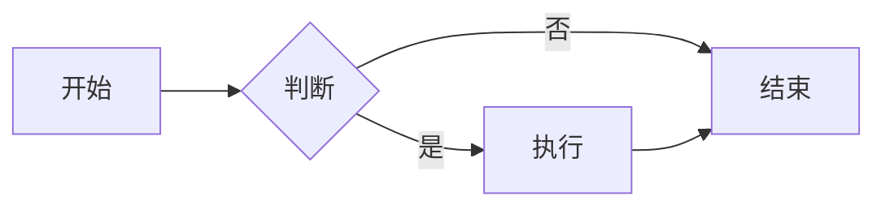

# 🧪 Test Page

这是一个测试页面，用于验证所有功能是否正常工作。

## 📊 Mermaid 图表测试



## 📋 表格测试

| 功能 | 状态 | 说明 |
|:-----|:-----|:-----|
| 中文字体 | ✅ | 使用了PingFang SC等中文友好字体 |
| Mermaid图表 | ✅ | 支持流程图和其他图表 |
| 代码高亮 | ✅ | 语法高亮正常显示 |
| 响应式设计 | ✅ | 移动端友好 |

## 💡 提示框测试

{: .note }
> 这是一个提示框，用于显示重要信息。

{: .highlight }
这是一个高亮框，用于强调重要内容。

## 🔧 代码块测试

```python
def hello_world():
    print("Hello, 世界!")
    return "成功"
```

```javascript
function sayHello() {
    console.log("Hello, 世界!");
    return "成功";
}
```

## 🔗 链接测试

- [返回首页](README.html)
- [快速开始指南](QUICK_START.html)
- [架构指南](ARCHITECTURE.html) 